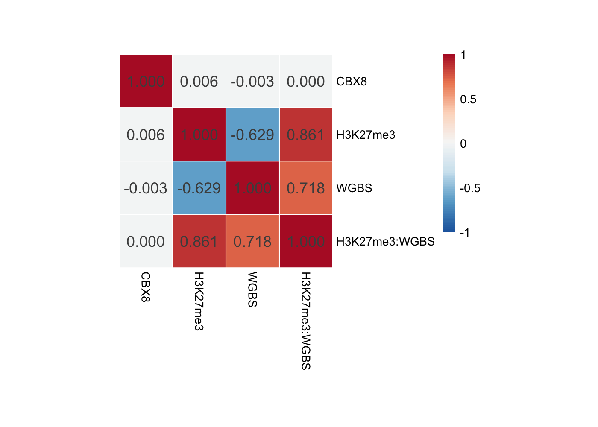

WGBS ChIP-seq comparison with ENCODE and ChIP-Atlas data
================
Compiled at 2023-09-20 19:25:35 UTC

The purpose of this document is to validate some of our results with
data from ENCODE and ChIP-Atlas.

In this script we analyze the data in A549, K562 cells, H1 cells, and
mES cells.

``` r
library(conflicted)
library(pheatmap)
library(RColorBrewer)
library(ggplot2)
library(ppcor)
```

# cell type: A549

We gather the data from the following sources:

H3K27me3: <https://www.encodeproject.org/files/ENCFF702IOJ/>

CBX8: <https://www.encodeproject.org/files/ENCFF081CPV/> (peak
identifier: ENCFF552VXR) WGBS (meDNA):
<https://www.encodeproject.org/files/ENCFF723WVM/>

As all files are of different lengths the average values for the
ChIP-Seq datasets are computed for consecutive genome bins (default
size: 10kb, 1000 bp, distance between bins: 0) by using the bins mode in
deeptools under removal of blacklisted regions to a multiBigwigSummary
object.

## Bin size: 1000bp

``` r
## read processed multiBigwigSummary object
pat <- "data/deeptools/"

multiBigwigSummary_A549 <- read.table(paste0(pat, "multiBigwigSummary_A549_CBX8_H3K27me3_WGBS.tabular"))

## change column names
colnames(multiBigwigSummary_A549) <- c('chr',   'start',    'end',  'CBX8', 'H3K27me3', 'WGBS')
```

### Only keep chromosome 1 - 22 and X

``` r
multiBigwigSummary_A549 <- multiBigwigSummary_A549[which(multiBigwigSummary_A549$chr %in% paste0('chr', c(1:22, "X"))), ]
dim(multiBigwigSummary_A549)
```

    ## [1] 2836092       6

Here’s the remaining set of chromosomes considered in out analysis

``` r
table(multiBigwigSummary_A549$chr)
```

    ## 
    ##   chr1  chr10  chr11  chr12  chr13  chr14  chr15  chr16  chr17  chr18  chr19 
    ## 226133 131154 131181 130385 112295  87090  77423  78989  78208  74483  54909 
    ##   chr2  chr20  chr21  chr22   chr3   chr4   chr5   chr6   chr7   chr8   chr9 
    ## 233706  61243  34582  45148 193878 186754 174916 168314 154768 141403 111475 
    ##   chrX 
    ## 147655

``` r
head(multiBigwigSummary_A549)
```

    ##    chr  start    end       CBX8 H3K27me3     WGBS
    ## 1 chr1 792500 793500 0.51563370        0 3.508191
    ## 2 chr1 793500 794500 0.09821392        0 3.994990
    ## 3 chr1 794500 795500 0.85706238        0 6.033869
    ## 4 chr1 795500 796500 0.15838046        0 5.627912
    ## 5 chr1 796500 797500 0.00000000        0 4.201556
    ## 6 chr1 797500 798500 0.30107969        0 4.192956

### Missing values

``` r
(colSums(is.na(multiBigwigSummary_A549))/nrow(multiBigwigSummary_A549))[4:6]
```

    ##         CBX8     H3K27me3         WGBS 
    ## 0.0001526749 0.0001614898 0.0143630743

### Dimension of the dataset

``` r
dim(multiBigwigSummary_A549)
```

    ## [1] 2836092       6

### Plot distribution of fold changes

``` r
# WGBS
distr_WGBS <- ggplot(multiBigwigSummary_A549, aes(x=WGBS)) + geom_histogram() + theme_minimal()

# H3K27me3
distr_H3K27me3 <- ggplot(multiBigwigSummary_A549, aes(x=H3K27me3)) + geom_histogram() + theme_minimal()

# CBX8
distr_CBX8 <- ggplot(multiBigwigSummary_A549, aes(x=log(CBX8+0.1) )) + geom_histogram() + theme_minimal()

gridExtra::grid.arrange(distr_WGBS, distr_H3K27me3, distr_CBX8)
```

<!-- -->

The WGBS data can take values between 0 and 100. For all the other data
fold changes to a reference genome are given.

## Kendall’s correlation

We look into Kendall’s partial correlation to account for the non-normal
distribution and for the fact that the WGBS data lives on a different
scale than the ChIP-seq data.

### Entire genome

``` r
mm <- multiBigwigSummary_A549[, c('CBX8',   'H3K27me3', 'WGBS')]
mm_int <- mm['H3K27me3'] * mm['WGBS']
names(mm_int) <- 'H3K27me3:WGBS'
mm <- cbind(mm, mm_int)
## remove rows with NA values
remove_rows <- which(rowSums(is.na(mm)) > 0 )
mm <- mm[-remove_rows, ]
```

``` r
set.seed(123)
subs <- sample(1:nrow(mm), 50000) ## only a subsample to reduce compute time
pkend_A549 <- pcor(mm[subs, ], method = "kendall")
```

``` r
pheatmap::pheatmap(pkend_A549$estimate, 
         breaks = seq(-1, 1, length.out = 40),
         color = colorRampPalette(rev(brewer.pal(n = 7, name = "RdBu")))(40),
         cluster_rows = F, 
         cluster_cols = F, 
         display_numbers = T, 
         number_format = "%.3f",
         fontsize_number = 13,
         cellwidth = 45,
         cellheight = 45, 
         border_color = "white")
```

<!-- -->

# cell type: K562

We gather the data from the following sources:

H3K27me3: <https://www.encodeproject.org/files/ENCFF405HIO/>

CBX8: <https://www.encodeproject.org/files/ENCFF687ZGN/> CBX8 peaks:
<https://www.encodeproject.org/files/ENCFF522HZT/>

WGBS (meDNA): <https://www.encodeproject.org/files/ENCFF459XNY/>

``` r
## read processed multiBigwigSummary object
multiBigwigSummary_K562 <- read.table(paste0(pat, "multiBigwigSummary_K562_CBX8_H3K27me3_WGBS.tabular"))

## change column names
colnames(multiBigwigSummary_K562) <- c('chr',   'start',    'end',  'WGBS', 'H3K27me3', 'CBX8')
```

### Only keep chromosome 1 - 22 and X

``` r
multiBigwigSummary_K562 <- multiBigwigSummary_K562[which(multiBigwigSummary_K562$chr %in% paste0('chr', c(1:22, "X"))), ]
dim(multiBigwigSummary_K562)
```

    ## [1] 2836092       6

Here’s the remaining set of chromosomes considered in our analysis

``` r
table(multiBigwigSummary_K562$chr)
```

    ## 
    ##   chr1  chr10  chr11  chr12  chr13  chr14  chr15  chr16  chr17  chr18  chr19 
    ## 226133 131154 131181 130385 112295  87090  77423  78989  78208  74483  54909 
    ##   chr2  chr20  chr21  chr22   chr3   chr4   chr5   chr6   chr7   chr8   chr9 
    ## 233706  61243  34582  45148 193878 186754 174916 168314 154768 141403 111475 
    ##   chrX 
    ## 147655

``` r
head(multiBigwigSummary_K562)
```

    ##      chr    start      end      WGBS   H3K27me3       CBX8
    ## 41 chr15 30627500 30628500 0.2784883 0.00118399 0.00000000
    ## 42 chr15 30628500 30629500 6.2682584 0.48814618 0.00000000
    ## 43 chr15 30629500 30630500 5.3411358 0.16575860 0.13102380
    ## 44 chr15 30630500 30631500 5.0698160 0.16575860 0.07206309
    ## 45 chr15 30631500 30632500 5.6093176 0.29244553 0.12301679
    ## 46 chr15 30632500 30633500 4.9796334 0.03907167 0.06696772

### Missing values

``` r
(colSums(is.na(multiBigwigSummary_K562))/nrow(multiBigwigSummary_K562))[4:6]
```

    ##         WGBS     H3K27me3         CBX8 
    ## 0.0175572584 0.0001502067 0.0001653684

### Dimension of the dataset

``` r
dim(multiBigwigSummary_K562)
```

    ## [1] 2836092       6

### Plot distribution of fold changes

``` r
# WGBS
distr_WGBS <- ggplot(multiBigwigSummary_K562, aes(x = WGBS)) + geom_histogram() + theme_minimal()

# H3K27me3
distr_H3K27me3 <- ggplot(multiBigwigSummary_K562, aes(x = H3K27me3)) + geom_histogram() + theme_minimal()

# CBX8
distr_CBX8 <- ggplot(multiBigwigSummary_K562, aes(x = CBX8)) + geom_histogram() + theme_minimal()


gridExtra::grid.arrange(distr_WGBS, distr_H3K27me3, distr_CBX8)
```

<!-- -->

The WGBS data can take values between 0 and 100. For all the other data
fold changes to a reference genome are given.

## Kendall’s correlation

``` r
mm <- multiBigwigSummary_K562[, c('CBX8',   'H3K27me3', 'WGBS')]
mm_int <- mm['H3K27me3'] * mm['WGBS']
names(mm_int) <- 'H3K27me3:WGBS'
mm <- cbind(mm, mm_int)
## remove rows with NA values
remove_rows <- which(rowSums(is.na(mm)) > 0 )
mm <- mm[-remove_rows, ]
```

``` r
set.seed(123)
subs <- sample(1:nrow(mm), 50000)
pkend_K562 <- pcor(mm[subs, ], method = "kendall")
```

``` r
pheatmap::pheatmap(pkend_K562$estimate, 
         breaks = seq(-1, 1, length.out = 40),
         color = colorRampPalette(rev(brewer.pal(n = 7, name = "RdBu")))(40),
         cluster_rows = F, 
         cluster_cols = F, 
         display_numbers = T, 
         number_format = "%.3f",
         fontsize_number = 13,
         cellwidth = 45,
         cellheight = 45, 
         border_color = "white")
```

<!-- -->

# cell type: H1

We gather the data from the following sources:

H3K27me3: <https://www.encodeproject.org/files/ENCFF345VHG/> (rep 1 + 2
combined)

CBX8: <https://www.encodeproject.org/files/ENCFF284JDC/> (rep 1 + 2
combined) (peaks: ENCFF483UZG) WGBS (meDNA):
<https://www.encodeproject.org/files/ENCFF975NYJ/>

``` r
## read processed multiBigwigSummary object

multiBigwigSummary_H1_1000bp <- read.table(paste0(pat, "multiBigwigSummary_H1_CBX8_H3K27me3_WGBS.tabular"))
```

``` r
## change column names
colnames(multiBigwigSummary_H1_1000bp) <- c('chr',  'start',    'end',  'H3K27me3', 'WGBS', 'CBX8')
```

### Only keep chromosome 1-22 and X

``` r
multiBigwigSummary_H1_1000bp <- multiBigwigSummary_H1_1000bp[which(multiBigwigSummary_H1_1000bp$chr %in% paste0('chr', c(1:22, "X"))), ]
dim(multiBigwigSummary_H1_1000bp)
```

    ## [1] 2836092       6

``` r
table(multiBigwigSummary_H1_1000bp$chr)
```

    ## 
    ##   chr1  chr10  chr11  chr12  chr13  chr14  chr15  chr16  chr17  chr18  chr19 
    ## 226133 131154 131181 130385 112295  87090  77423  78989  78208  74483  54909 
    ##   chr2  chr20  chr21  chr22   chr3   chr4   chr5   chr6   chr7   chr8   chr9 
    ## 233706  61243  34582  45148 193878 186754 174916 168314 154768 141403 111475 
    ##   chrX 
    ## 147655

``` r
(colSums(is.na(multiBigwigSummary_H1_1000bp))/nrow(multiBigwigSummary_H1_1000bp))[4:6]
```

    ##     H3K27me3         WGBS         CBX8 
    ## 0.0001593742 0.0145376102 0.0001502067

### Plot distribution of fold changes

``` r
# WGBS
distr_WGBS <- ggplot(multiBigwigSummary_H1_1000bp, aes(x=WGBS)) + geom_histogram() + theme_minimal()

# H3K27me3
distr_H3K27me3 <- ggplot(multiBigwigSummary_H1_1000bp, aes(x=H3K27me3)) + geom_histogram() + theme_minimal()

# CBX8
distr_CBX8 <- ggplot(multiBigwigSummary_H1_1000bp, aes(x=CBX8)) + geom_histogram() + theme_minimal()

gridExtra::grid.arrange(distr_WGBS, distr_H3K27me3, distr_CBX8)
```

<!-- -->

## Kendall’s correlation

``` r
mm <- multiBigwigSummary_H1_1000bp[, c('CBX8',  'H3K27me3', 'WGBS')]
mm_int <- mm['H3K27me3'] * mm['WGBS']
names(mm_int) <- 'H3K27me3:WGBS'
mm <- cbind(mm, mm_int)
## remove rows with NA values
remove_rows <- which(rowSums(is.na(mm)) > 0 )
mm <- mm[-remove_rows, ]
```

``` r
set.seed(123)
subs <- sample(1:nrow(mm), 50000)
pkend_H1 <- pcor(mm[subs, ], method = "kendall")
```

``` r
pheatmap::pheatmap(pkend_H1$estimate, 
         breaks = seq(-1, 1, length.out = 40),
         color = colorRampPalette(rev(brewer.pal(n = 7, name = "RdBu")))(40),
         cluster_rows = F, 
         cluster_cols = F, 
         display_numbers = T, 
         number_format = "%.3f",
         fontsize_number = 13,
         cellwidth = 45,
         cellheight = 45, 
         border_color = "white")
```

<!-- -->

# mES cells

CBX8 mm9 BigWig: <https://chip-atlas.org/view?id=SRX426373> (peak:
SRX5090173.05) H3K27me3 mm9 BigWig:
<https://chip-atlas.org/view?id=SRX006968> WGBS mm9 BigWig (Methylation
rate): <https://chip-atlas.org/view?id=DRX001152> blacklisted regions
mm9:
<https://mitra.stanford.edu/kundaje/akundaje/release/blacklists/mm9-mouse/>

``` r
## read processed multiBigwigSummary object

multiBigwigSummary_mES <- read.table(paste0(pat, "multiBigwigSummary_mES_CBX8_H3K27me3_WGBS.tabular"))
```

``` r
colnames(multiBigwigSummary_mES) <- c('chr',    'start',    'end','H3K27me3', 'CBX8', 'WGBS')
```

### Only keep chromosome 1-22 and X

``` r
multiBigwigSummary_mES <- multiBigwigSummary_mES[which(multiBigwigSummary_mES$chr %in% paste0('chr', c(1:22, "X"))), ]
dim(multiBigwigSummary_mES)
```

    ## [1] 2631853       6

``` r
table(multiBigwigSummary_mES$chr)
```

    ## 
    ##   chr1  chr10  chr11  chr12  chr13  chr14  chr15  chr16  chr17  chr18  chr19 
    ## 196687 129671 121685 120841 119819 124806 103236  98106  95002  90533  61128 
    ##   chr2   chr3   chr4   chr5   chr6   chr7   chr8   chr9   chrX 
    ## 181225 159128 155095 152151 149091 152136 131479 123849 166185

### How many NaNs are in the data?

``` r
(colSums(is.na(multiBigwigSummary_mES))/nrow(multiBigwigSummary_mES))[4:6]
```

    ##  H3K27me3      CBX8      WGBS 
    ## 0.1156607 0.1220623 0.5781322

### Plot distribution of fold changes

``` r
# WGBS
distr_WGBS <- ggplot(multiBigwigSummary_mES, aes(x=WGBS)) + geom_histogram() + theme_minimal()

# H3K27me3
distr_H3K27me3 <- ggplot(multiBigwigSummary_mES, aes(x=H3K27me3)) + geom_histogram() + theme_minimal()

# CBX8
distr_CBX8 <- ggplot(multiBigwigSummary_mES, aes(x=CBX8)) + geom_histogram() + theme_minimal()

gridExtra::grid.arrange(distr_WGBS, distr_H3K27me3, distr_CBX8)
```

<!-- -->

## Kendall’s correlation

``` r
mm <- multiBigwigSummary_mES[, c('CBX8',    'H3K27me3', 'WGBS')]
mm_int <- mm['H3K27me3'] * mm['WGBS'] 
names(mm_int) <- 'H3K27me3:WGBS' 
mm <- cbind(mm, mm_int)
## remove rows with NA values
remove_rows <- which(rowSums(is.na(mm)) > 0 )
mm <- mm[-remove_rows, ]
```

``` r
set.seed(123)
subs <- sample(1:nrow(mm), 50000)
pkend_mES <- pcor(mm[subs, ], method = "kendall")
```

``` r
pheatmap::pheatmap(pkend_mES$estimate, 
         breaks = seq(-1, 1, length.out = 100),
         color = colorRampPalette(rev(brewer.pal(n = 7, name = "RdBu")))(100),
         cluster_rows = F, 
         cluster_cols = F, 
         display_numbers = T, 
         number_format = "%.3f",
         fontsize_number = 13,
         cellwidth = 45,
         cellheight = 45, 
         border_color = "white")
```

<!-- -->

## Files written

These files have been written to the target directory,
`data/script__WGBS_ChIP-seq_comparison`:

``` r
projthis::proj_dir_info(path_target())
```

    ## # A tibble: 0 × 4
    ## # ℹ 4 variables: path <fs::path>, type <fct>, size <fs::bytes>,
    ## #   modification_time <dttm>
