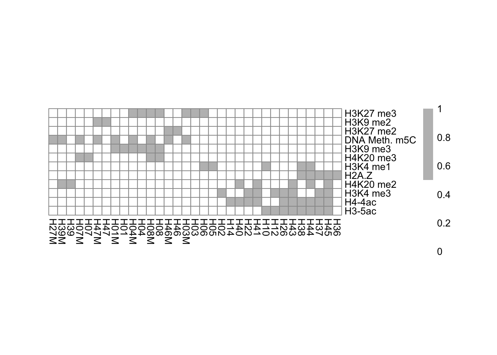
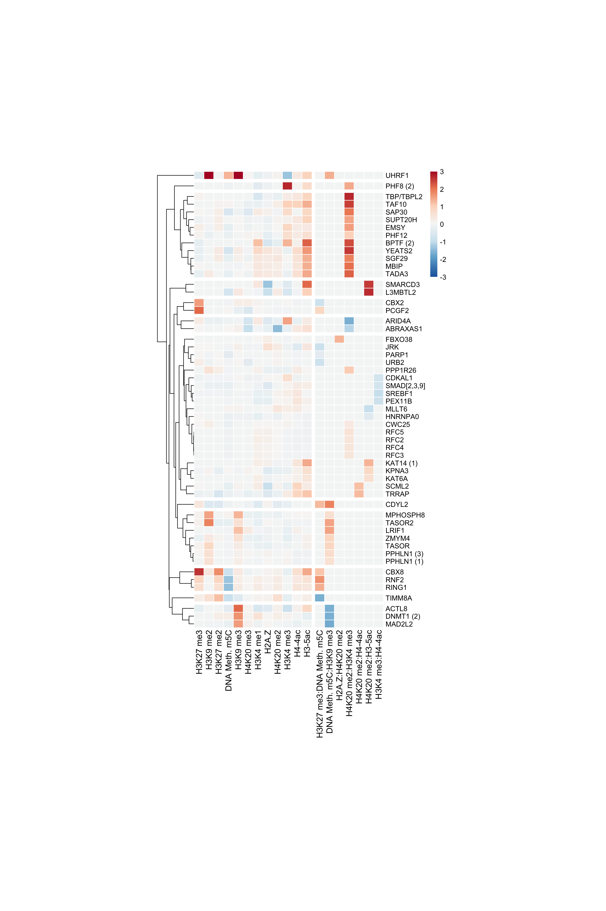
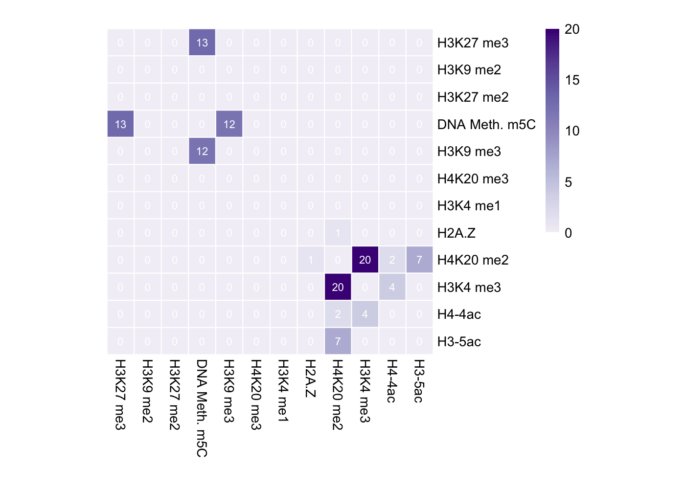
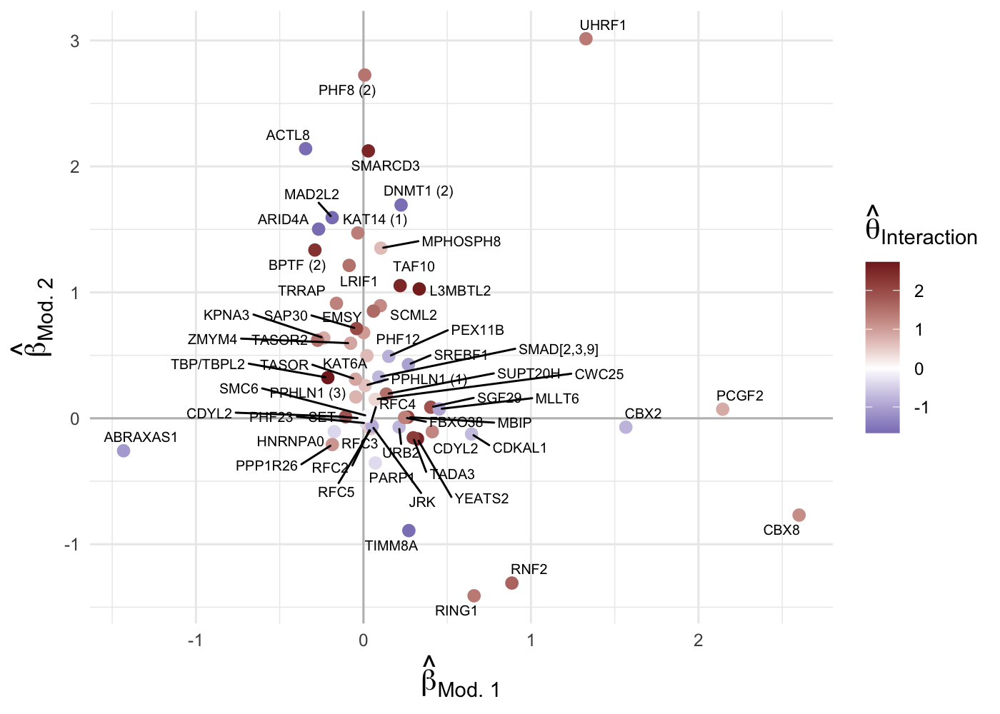
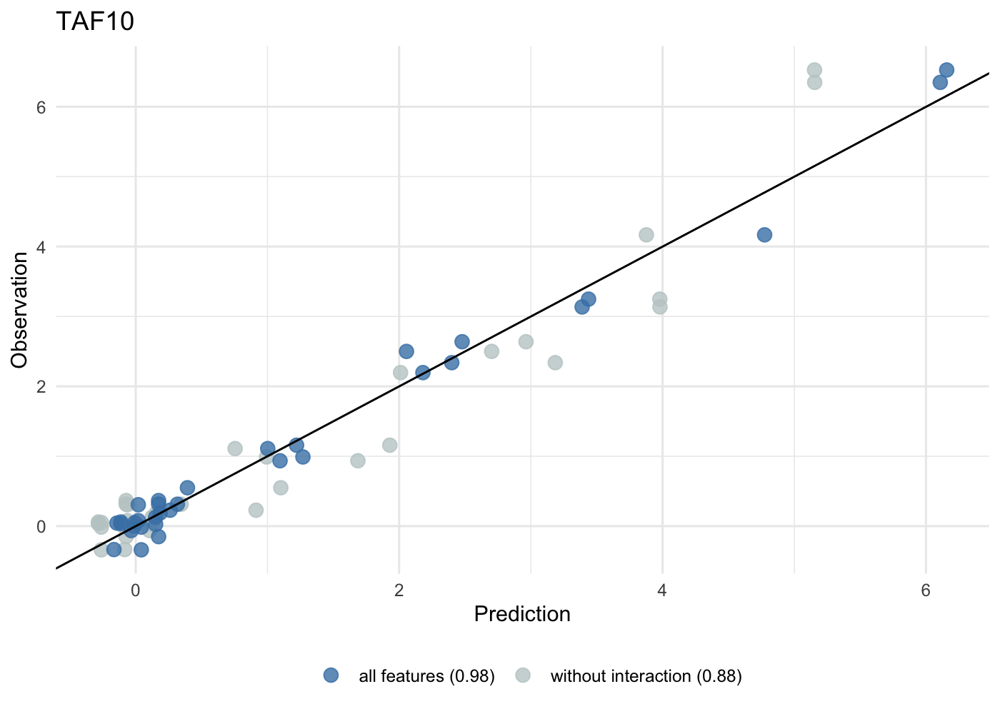
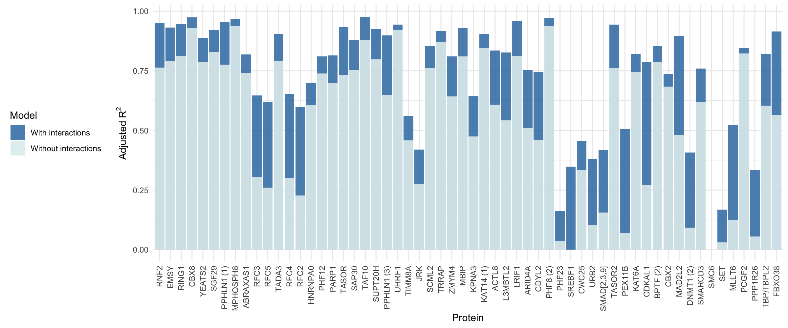
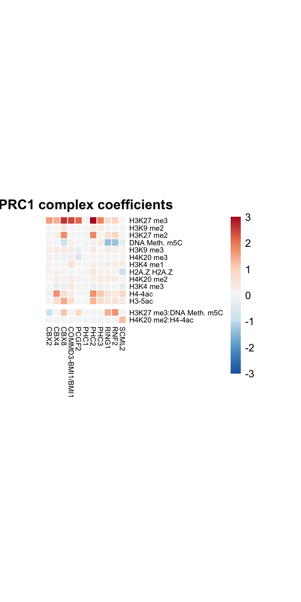
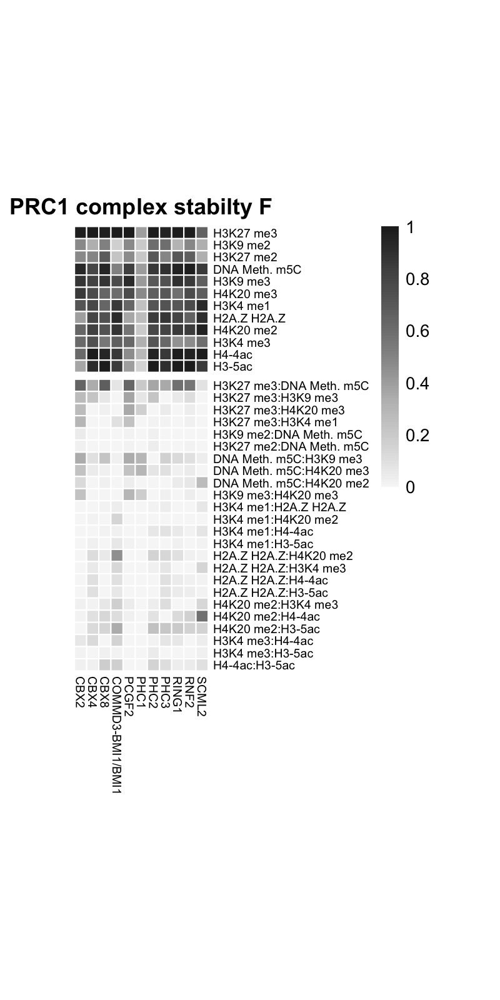
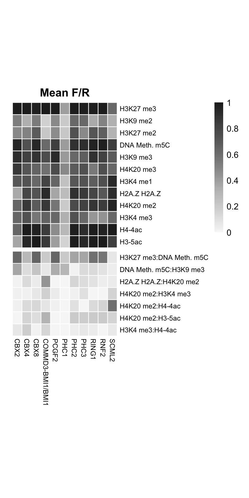

Analysis: A statistical workflow for the robust detection of interaction
effects between chromatin modifications
================
2023-07-28

## Overview

This document contains the analysis of interaction effects between
chromatin modifications by using the MARCS dataset and the statistical
workflow proposed in our data. All Figures showing the results in the
paper can be reproduced in this script.

## Load packages

``` r
packages_workflow <- c("RColorBrewer", "pheatmap", "dplyr", "tidyr", "tibble",
                       "ggplot2", "gridExtra", "venn", "ggpolypath", "readxl",
                       "tidyverse", "viridis", "patchwork", "networkD3", 
                       "igraph")

load_packages <- lapply(packages_workflow, require, character.only = TRUE)
```

## Load data

Here we load the experimental design matrix L and the protein binding
matrix P which contains both replicates for each of the $p=1915$
proteins.

``` r
## data
L <- readRDS("data/input/L-library.rds")
P <- readRDS("data/input/P-proteinsFandR.rds")
```

### Heatmap protein binding matrix P

``` r
pheatP <- pheatmap::pheatmap(P, cluster_rows = F, cluster_cols = T, 
                   border_color = "white",
                   color = colorRampPalette(rev(brewer.pal(n = 7, name =
  "RdBu")))(100), breaks = seq(-2, 2, length.out = 100),
                   cellwidth = 0.1, cellheight = 8,
                   fontsize_row = 6, fontsize_col = 0.0001
              )
```

<!-- -->

### Heatmap experimental design matrix L

``` r
pheatP <- pheatmap::pheatmap(t(L), cluster_rows = F, cluster_cols = F, 
                   color = c("white", "gray"),
                   cellwidth = 9, cellheight = 9
              )
```

<!-- -->

## Run workflow for MARCS data

Here, we show how to run the workflow. We start with running hiernet
with stability selection for all proteins. This takes some time, so one
should run this code in parallel on a cluster. To only try the workflow
one can run it for only a few proteins (e.g. as.list(1:3)).

``` r
source("R/mainFunctions.R")
stabsel_hiernet_cluster <- parallel::mclapply(as.list(1:1915),
                                  function(p, P, L){return(stabsel_hiernet(p, P, L))},
                                  P = P_, L = L_,
                                  mc.cores = 20, mc.preschedule = FALSE)
```

We don’t run the code here, therefore we import the results now.

``` r
CPSS_F <- readRDS("data/results/CPSS_F.rds")
CPSS_R <- readRDS("data/results/CPSS_R.rds")
```

The `run_workflow` function returns the selected features for all
proteins. Now one needs to perform the refitting on the mean over the
replicates.

### Refitting after filtering

``` r
## compute mean
Pmean = log((2^P[, 1:1915] + 2^P[, (1915 + 1):ncol(P)])/2, base = 2)
```

``` r
source("R/mainFunctions.R")

L_ <- L;  P_ <- P; CPSS_F_ <- CPSS_F; CPSS_R_ <- CPSS_R

output_workflow <- run_workflow(L = L_, P = P_, CPSS_F = CPSS_F_, CPSS_R = CPSS_R_)

coef_matrix <- output_workflow$coef_matrix
keep_or_not <- output_workflow$keep_or_not
fit_lm <- output_workflow$refit_lm
```

### Estimated coefficients

``` r
coef_matrix[1:5,1:5]
```

    ##                   CTNNBL1        CLK4     RCC1 (2)      ZNF395       LIN9
    ## H3K27 me3      0.13363878 -0.03878053 -0.007760259 -0.01836988 -0.1030896
    ## H3K9 me2       0.04893225 -0.01042962 -0.303350964  0.00000000 -0.3454179
    ## H3K27 me2     -0.09835476 -0.09665980  0.000000000  0.00000000 -0.3454179
    ## DNA Meth. m5C  0.13602604  0.02236041  0.031022443 -0.06607597 -0.2510683
    ## H3K9 me3      -0.03188206  0.11128244 -0.024817570 -0.03284810 -0.1176556

``` r
## Remove zero rows and zero columns:
zero_rows <- apply(coef_matrix, 1, function(x) all(x == 0))
zero_cols <- apply(coef_matrix, 2, function(x) all(x == 0))

## what proteins do respond to interaction effects?
interaction_proteins <- apply(coef_matrix[13:nrow(coef_matrix),], 2, function(x) !all(x == 0))
sum(interaction_proteins)
```

    ## [1] 58

In total, there are 58 proteins for which we do find interaction
effects.

### Visualize estimated coefficients for proteins with interaction effects

``` r
data_int1 <- paste0(names(interaction_proteins[interaction_proteins == TRUE]))

data_int <- paste0(rep(names(interaction_proteins[interaction_proteins == TRUE]), each = 2), c("_F", "_R"))


pheatmap::pheatmap(coef_matrix[!zero_rows, !zero_cols][, data_int1], 
                   fontsize_row = 8, 
                   fontsize_col = 8, 
                   color = colorRampPalette(rev(brewer.pal(
                     n = 7, name = "RdBu")))(100),  
                   breaks = seq(-3, 3, length.out = 100), 
                   angle_col = 90,
                   cluster_rows = F, 
                   cluster_cols = T, 
                   border_color = "white",
                   cellwidth = 14, 
                   cellheight = 11, 
                   cutree_cols = 12,
                   treeheight_col = 9, 
                   gaps_row = 12)
```

<!-- -->

### Visualize how often what combi is observed (linear vs. interaction)

``` r
q = 12
df_overview <- matrix(ncol = 4, nrow = (12 * 13/2 - 12))
colnames(df_overview) <- c("Mod1", "Mod2", "BothLin", "Interaction")
n = 0
for(i in 1:(q - 1)){
  for(j in (i + 1):q){
    n = n + 1
    sel_i <- (coef_matrix[i, ] != 0)
    sel_j <- (coef_matrix[j, ] != 0)
    bothlin_ij = sum(((sel_i + sel_j) == 2))
    int_ij <- paste0(rownames(coef_matrix)[i], ":", rownames(coef_matrix)[j])
    if(int_ij %in% rownames(coef_matrix)){
      interaction_ij = sum(coef_matrix[int_ij,] != 0)
    }
    else{interaction_ij = 0}
    
    df_overview[n, ] <- c(rownames(coef_matrix)[i], rownames(coef_matrix)[j],
                          bothlin_ij, interaction_ij)

  }
}
df_overview <- as.data.frame(df_overview)
df_overview$BothLin <- as.numeric(df_overview$BothLin)
df_overview$Interaction <- as.numeric(df_overview$Interaction)


lin_mat = reshape2::acast(df_overview, Mod1 ~ Mod2, value.var = "BothLin")
int_mat = reshape2::acast(df_overview, Mod1 ~ Mod2, value.var = "Interaction")
lin_mat <- round(lin_mat)
lin_mat[is.na(lin_mat)] <- 0
int_mat[is.na(int_mat)] <- 0


# Make undirected so that graph matrix will be symmetric
g <- graph.data.frame(df_overview[,-4], directed=FALSE)
# add value as a weight attribute
lin_mat = get.adjacency(g, attr="BothLin", sparse=FALSE)

g2 <- graph.data.frame(df_overview[,-3], directed=FALSE)
# add value as a weight attribute
int_mat = get.adjacency(g2, attr="Interaction", sparse=FALSE)
diag(lin_mat) <- NA
lin_int_mat <- lin_mat
lin_int_mat[lower.tri(lin_int_mat)] <- int_mat[lower.tri(int_mat)]


pheatmap(lin_int_mat, cluster_rows = F, cluster_cols = F,
         border_color = "white", cellheight = 20, cellwidth = 20,
         fontsize_row = 9, fontsize_col = 9,
         na_col = "white",
         color = colorRampPalette((brewer.pal(n = 7, name = "Blues")))(100), 
         breaks = c(seq(0, .99, length.out =  10), seq(1, 70, length.out =  60), 
                    seq(71, 454, length.out = 30)),
         display_numbers = T, number_format =  "%.0f", 
         number_color = "white",
         legend = F)
```

<!-- -->

### Design: how often does a combination of modifications occur together?

``` r
pheatmap(int_mat, cluster_rows = F, cluster_cols = F,
         border_color = "white", cellheight = 20, cellwidth = 20,
         color = colorRampPalette((brewer.pal(n = 7, name =
  "Purples")))(100),
  display_numbers = T, number_format =  "%.0f", number_color = "white"
  )
```

<!-- -->

## Plot P matrix for 58 proteins of interest

``` r
## number of proteins with interaction effects


P_int = P[, data_int]
for(i in seq(1, ncol(P_int), by = 2)){
  if(!all(sign(P_int[, i]) == sign(P_int[, i + 1]))){
    toNA <- which(sign(P_int[, i]) != sign(P_int[, i + 1]))
    P_int[toNA, i] <- NA
    P_int[toNA, i + 1] <- NA
  }
  
}
P_int_plt = P_int
P_int_plt[is.na(P_int_plt)] <- 10000
## adapt order: from low number of zero-imputation + excluded experiments
myrank = colSums(P_int_plt == 10000) + colSums(P_int_plt == 0)
P_int_plt = P_int_plt[, names(sort((rank(myrank, ties.method = "first"))))]
P_int_plt[P_int_plt==0] <- NA
P_int_plt <- P_int_plt[, names(sort((rank(colSums(is.na(P_int_plt)), ties.method = "first"))))]

colramp = colorRampPalette(rev(brewer.pal(n = 7, name = "RdBu")))(115)
colramp = colramp[c(1:49, 65:115)]


pheatP_int <- pheatmap(P_int_plt, cluster_cols = F, cluster_rows = F,
         color = c(colramp, "grey75"), 
         breaks = c(seq(-abs(max(P_int, na.rm = T)), abs(max(P_int, na.rm = T)),
                        length.out = 100), abs(max(P_int, na.rm = T)) + 1),
         fontsize_row = 0.0001, fontsize_col = rep(c(13, 0.0001), 50), 
         labels_col = substr(colnames(P_int_plt), 1, 
                             nchar(colnames(P_int_plt)) - 2),
         cellheight = 16, cellwidth = 8, 
         border_color = "white",
         na_col = "grey99", 
         angle_col = 90,
         gaps_col = seq(from = 2, to = 98, by =2)
         )
```

<!-- -->

## Refitting without interaction coefficients

``` r
index_int <- which(interaction_proteins == TRUE)
n <- 0

L_interactions <- cbind(L, hierNet::compute.interactions.c(L, diagonal = F)) ## add interactions

fit_lm_no_int <- list()

rownames(coef_matrix) <- colnames(L_interactions)
for(p in index_int){
  selF_p <- which(CPSS_F[[p]]$max >= .5)
  selR_p <- which(CPSS_R[[p]]$max >= .5)
  n <- n + 1
  Pmean_p <- log((2^P[, p] + 2^P[, p + 1915])/2, base = 2)
  index_features <- intersect(selR_p, selF_p)
  lin_features <- index_features[index_features < 13]
  Lint <- L_interactions[, lin_features]
  fit_lm_no_int[[p]] <- lm(Pmean_p ~ Lint)
}
```

## Scatterplot interaction coefficients

``` r
source("R/plotFunctions.R")
scatterplot_interactions(coef_matrix, index_int, q = 12) + 
    xlab(bquote(hat(beta)["Mod. 1"])) + 
    ylab(bquote(hat(beta)["Mod. 2"]))  + 
    labs(color=bquote(hat(theta)["Interaction"])) 
```

<!-- -->

``` r
Proteins_int <- names(interaction_proteins[interaction_proteins == TRUE])
```

## Prediction versus real values Scatterplots (linear vs. linear + int.)

``` r
n <- 0
plot_list_p_phat <- list()


for(pint in Proteins_int){
  n <- n + 1
  p <- which(colnames(P) == paste0(pint, "_F"))
  Pmean_p <- log((2^P[, p] + 2^P[, p + 1915])/2, base = 2)
  pred_p <- predict(fit_lm[[p]])
  pred_p_no_int <- predict(fit_lm_no_int[[p]])
  
  df_p <- data.frame("Prediction" = c(pred_p_no_int, pred_p),
                     "Legend" = rep(c(paste0("without interaction (",
                                            round(summary(fit_lm_no_int[[p]])$adj.r.squared, 2), ")"),
                                      paste0("all features (",
                                              round(summary(fit_lm[[p]])$adj.r.squared, 2), ")")),
                                   each = length(pred_p)),
                     "Observation" = rep(Pmean_p, 2))
 
  
  plot_list_p_phat[[n]] <- ggplot(df_p, 
                                  aes(x = Prediction, 
                                      y = Observation)) + 
    geom_point(alpha = .8, aes(color = Legend), size = 3) +

    theme_minimal() +
    geom_abline(intercept = 0, slope = 1) +
    ggtitle(pint) +
  theme(legend.position="bottom", legend.title = element_blank()) + 
    scale_color_manual(values=c("steelblue", " azure3"))


}

plot_list_p_phat[which(Proteins_int == "TAF10")]
```

    ## [[1]]

<!-- -->

## Barplot r-squared

``` r
r_squared <- c()
r_squared_noint <- c()

for(pint in Proteins_int
    ){
  
  p <- which(colnames(P) == paste0(pint, "_F"))
  if(!is.null(fit_lm[[p]])){
    r_squared[p] <- summary(fit_lm[[p]])$adj.r.squared
  }
  if(!is.null(fit_lm_no_int[[p]])){
    r_squared_noint[p] <- summary(fit_lm_no_int[[p]])$adj.r.squared
  }
}
r_squared_all = c()
for(pint in 1:1915){
  p = pint
  if(!is.null(fit_lm[[p]])){
    r_squared_all[p] <- summary(fit_lm[[p]])$adj.r.squared
  }
  
}
```

``` r
r_squared_int = na.omit(r_squared)
names(r_squared_int) <- Proteins_int


r_squarednoint = na.omit(r_squared_noint)
names(r_squarednoint) <- Proteins_int

df2 = data.frame("Rsquared" = c(r_squared_int, r_squarednoint), 
                 "Model" = c(rep("With interactions", length(r_squared_int)),
                             rep("Without interactions", length(r_squarednoint))),
                 "Protein" = c(names(r_squared_int), names(r_squarednoint))
                 )
order_nb_zeros <- names(sort((rank(colSums(is.na(P_int_plt)), ties.method = "first"))))
order_nb_zeros <- substr(order_nb_zeros, 1, nchar(order_nb_zeros) - 2)
order_nb_zeros <- order_nb_zeros[seq(1, length(order_nb_zeros), by = 2)]


df2$Protein <- factor(df2$Protein, levels = order_nb_zeros)
df2$Rsquared[df2$Rsquared<0] <- 0


ggplot(data=df2, aes(x=Protein, y=Rsquared, fill=Model)) +
  geom_bar(stat="identity", position="identity", alpha = .9) +
  scale_fill_manual(values = c("steelblue", " azure2")) +
  theme_minimal() +
    theme(axis.text.x = element_text(angle = 90, vjust = 0.5, hjust=1),
          legend.position="left") +
  labs(y = expression(paste('Adjusted ', R^2)))
```

<!-- -->

## Compare overlap of selected proteins with interactions for different thresholds

``` r
compare_threshold <- function(pi_thr = .6){
  
  
  keep_or_not <- c()
  n <- 0
  
  L_interactions <- cbind(L, hierNet::compute.interactions.c(L, diagonal = F)) ## add interactions
  
  fit_lm <- list()
  coef_matrix <- matrix(NA, nrow = ncol(L_interactions), ncol = 1915)
  rownames(coef_matrix) <- colnames(L_interactions)
  colnames(coef_matrix) <- substr(colnames(P[, 1:1915]),1, nchar(colnames(P[, 1:1915]))-2)
  for(p in 1:1915){
    
    if(class(CPSS_F[[p]]) != "empty" | class(CPSS_R[[p]]) != "empty" ){
      selF_p <- which(CPSS_F[[p]]$max >= pi_thr)
      selR_p <- which(CPSS_R[[p]]$max >= pi_thr)
      
      if(length(selF_p) != 0 & length(selR_p) != 0){
        if(!is.null(selF_p) & !is.null(selR_p)){
          if(length(intersect(selR_p, selF_p)) >0 ){
            
            keep_or_not[p] <- 1
            n <- n + 1
            Pmean_p <- log((2^P[, p] + 2^P[, p + 1915])/2, base = 2)
            Lint <- L_interactions[, intersect(selR_p, selF_p)]
            fit_lm[[p]] <- lm(Pmean_p ~ Lint)
            beta <- fit_lm[[p]]$coefficients[-1]
            names(beta) <- colnames(Lint)
            coef_matrix[names(beta), p] <- beta
            #}
            # else{keep_or_not[p] <- 0}
          }
        }
      }
    }
    else{keep_or_not[p] <- 0}
  }
  coef_matrix[is.na(coef_matrix)] <- 0
  interaction_proteins <- apply(coef_matrix[13:nrow(coef_matrix),], 2, function(x) !all(x == 0))
  
  Int_prot <- names(interaction_proteins[which(interaction_proteins == TRUE)])
  return(Int_prot)
}
#


Int_prot05 <- compare_threshold(0.5)
Int_prot055 <- compare_threshold(0.55)
Int_prot06 <- compare_threshold(0.6)
Int_prot065 <- compare_threshold(0.65)
Int_prot07 <- compare_threshold(0.7)


list_int <- list("50 %" = Int_prot05, "55 %" = Int_prot055, 
                 "60 %" = Int_prot06, "65 %" = Int_prot065,
                 "70 %" = Int_prot07)

venn(list_int, ilab=TRUE, zcolor = "style", box = F, ggplot = T )
```

<!-- -->

## Visualization of selection probabilities for protein complexes

``` r
## data

Table_S6 <- read_excel("data/input/TableS6_complexes.xlsx")

Table_S6 <- Table_S6 %>% fill(`Protein complex name`, .direction = c("down"))
complexes <- Table_S6[, 1:2]
head(complexes)
```

    ## # A tibble: 6 × 2
    ##   `Protein complex name` `Our identifier` 
    ##   <chr>                  <chr>            
    ## 1 40S Ribosomal subunit  FAU              
    ## 2 40S Ribosomal subunit  RPS10/RPS10-NUDT3
    ## 3 40S Ribosomal subunit  RPS11            
    ## 4 40S Ribosomal subunit  RPS12            
    ## 5 40S Ribosomal subunit  RPS13            
    ## 6 40S Ribosomal subunit  RPS14

Create a selection probability matrix (F and R) with all proteins

``` r
SelProb_F <- matrix(nrow = 78, ncol = 1915)
SelProb_R <- matrix(nrow = 78, ncol = 1915)

rownames(SelProb_F) <- names(CPSS_F[[1]]$max)
rownames(SelProb_R) <- names(CPSS_R[[1]]$max)

colnames(SelProb_F) <- colnames(coef_matrix)
colnames(SelProb_R) <- colnames(coef_matrix)

for(p in 1:1915){
  if(!class(CPSS_F[[p]]) == "empty"){
  SelProb_F[names(CPSS_F[[p]]$max), p] <- CPSS_F[[p]]$max
  SelProb_R[names(CPSS_R[[p]]$max), p] <- CPSS_R[[p]]$max
  }
}

SelProb_F[is.na(SelProb_F)] <- 0
SelProb_R[is.na(SelProb_R)] <- 0
```

``` r
### PRC1 complex
PRC1_complex = complexes[which(complexes$`Protein complex name` == "PRC1"), ]
PRC1_complex = PRC1_complex[!is.na(PRC1_complex$`Our identifier`), ] 

### TFIID complex
TFIID_complex = complexes[which(complexes$`Protein complex name` == "TFIID"), ]
TFIID_complex = TFIID_complex[!is.na(TFIID_complex$`Our identifier`), ] 

### SAGA complex
SAGA_complex = complexes[which(complexes$`Protein complex name` == "SAGA"), ]
SAGA_complex = SAGA_complex[!is.na(SAGA_complex$`Our identifier`), ] 

### Integrator complex
Integrator_complex = complexes[which(complexes$`Protein complex name` == "Integrator"), ]
Integrator_complex = Integrator_complex[!is.na(Integrator_complex$`Our identifier`), ] 

### Mediator complex

Mediator_complex = complexes[which(complexes$`Protein complex name` == "Mediator"), ]
Mediator_complex = Mediator_complex[!is.na(Mediator_complex$`Our identifier`), ] 

### ncPRC1.6 complex
ncPRC1.6_complex = complexes[which(complexes$`Protein complex name` == "ncPRC1.6"), ]
ncPRC1.6_complex = ncPRC1.6_complex[!is.na(ncPRC1.6_complex$`Our identifier`), ] 

### HUSH complex
HUSH_complex = complexes[which(complexes$`Protein complex name` == "HUSH"), ]

### ATAC complex
ATAC_complex = complexes[which(complexes$`Protein complex name` == "ATAC"), ]
ATAC_complex = ATAC_complex[!is.na(ATAC_complex$`Our identifier`), ] 
```

### Heatmap of selection probabilities

With this code heatmaps for coefficients and selection probablities for
each complex can be reproduced. We only show the plots for PRC1 here.

``` r
## loop over all complexes

zero_rows_all <- apply(coef_matrix, 1, function(x) all(x == 0))
non_zero_coef_names <- names(which(zero_rows_all==FALSE))

all_complexes <- list(PRC1_complex, TFIID_complex, SAGA_complex, 
                      Integrator_complex, Mediator_complex, ncPRC1.6_complex,
                      HUSH_complex, ATAC_complex)
Sel_FR <- list(SelProb_F, SelProb_R)
all_complexes_names <- c("PRC1 complex", "TFIID complex", "SAGA complex",
                         "Integrator complex", "Mediator complex",
                         "ncPCR1.6 complex", "HUSH complex", "ATAC complex")
fr_name <- c("F", "R")

## Mean selection probability within complex
mean_sel_prob_F <- matrix(ncol = length(all_complexes), nrow = 78)
mean_sel_prob_R <- matrix(ncol = length(all_complexes), nrow = 78)

for(compl in 1:length(all_complexes)){
  
  if(compl > 1){silent = T} # only plot PRC1 complex here
  else{silent = F}
  comp <- all_complexes[[compl]]
  comp <- as.data.frame(comp)
  
  ## First heatmap with coefficients
  comp_ind <- comp[, "Our identifier"]
  ind <- which(comp_ind %in% colnames(coef_matrix))
  comp_ind <- comp_ind[ind]

  coef_comp <- coef_matrix[, comp_ind]
  
  zero_rows <- apply(coef_comp, 1, function(x) all(x == 0))
  main0 <- paste0(all_complexes_names[compl], " coefficients")
  
  ## keep all linear features:
  zero_rows[1:12] <- F
  
  pheatmap::pheatmap(coef_comp[!zero_rows, ], 
                     fontsize_row = 7, 
                     fontsize_col = 7, 
                     color = colorRampPalette(rev(brewer.pal(n = 7, name ="RdBu"
                                                             )))(100),  
                     breaks = seq(-3, 3, length.out = 100),
                     cellheight = 7, 
                     cellwidth = 7,
                     border_color = "white",
                     cluster_rows = F, 
                     cluster_cols = F,
                     treeheight_col = 0, 
                     fontsize = 10,
                     main = main0,
                     gaps_row = 12,
                     silent = silent)
  
  
  ## Now heatmaps of stability profiles
  for(fr in 1:length(Sel_FR)){
    
    FR <- Sel_FR[[fr]]
    FR <- as.data.frame(FR)
    comp_ind <- comp[, "Our identifier"]
    ind <- which(comp_ind %in% colnames(FR))
    comp_ind <- comp_ind[ind]
    SelProb_comp <- FR[, comp_ind]
    zero_rows_comp <- apply(SelProb_comp, 1, function(x) all(x <0.2))
    
    
    
    main <- paste0(all_complexes_names[compl], " stabilty ", fr_name[fr])
    if(fr == 1) {
      mean_sel_prob_F[, compl] <- rowMeans(SelProb_comp)
      SelProb_comp1 <- SelProb_comp[non_zero_coef_names, ]
      }
    if(fr == 2){
      mean_sel_prob_R[, compl] <- rowMeans(SelProb_comp)
      SelProb_comp2 <- SelProb_comp[non_zero_coef_names, ]
    }

    pheatmap::pheatmap(SelProb_comp[which(rowSums(SelProb_comp)>0), ],#[non_zero_coef_names, ], 
                       fontsize_row = 7, 
                       fontsize_col = 7, 
                       color = colorRampPalette((brewer.pal(n = 7, name = "Greys")
                       ))(100), # breaks = seq(-3, 3, length.out = 100),
                       cellheight = 7, 
                       cellwidth = 7,
                       border_color = "white",
                       cluster_rows = F, 
                       cluster_cols = F,
                       main = main,
                       gaps_row = 12,
                       silent = silent)
  }
  
  
  ## Now mean of the two stability profiles
   pheatmap::pheatmap((SelProb_comp1 + SelProb_comp2)/2,
                       fontsize_row = 8,
                       fontsize_col = 8,
                       color = colorRampPalette((brewer.pal(n = 7, name = "Greys")
                       ))(100), # breaks = seq(-3, 3, length.out = 100),
                       
                       cellwidth = 11, 
                      cellheight = 14,
                       border_color = "white",
                       cluster_rows = F,
                       cluster_cols = F,
                       main = "Mean F/R",
                       gaps_row = 12,
                       silent = silent)
}
```

<!-- --><!-- --><!-- --><!-- -->

### Mean Selection probability for each complex

``` r
## Mean over F and R experiment
mean_sel_prob <- (mean_sel_prob_F + mean_sel_prob_R)/2
colnames(mean_sel_prob) <- all_complexes_names
rownames(mean_sel_prob) <- rownames(SelProb_F)
head(mean_sel_prob)
```

    ##               PRC1 complex TFIID complex SAGA complex Integrator complex
    ## H3K27 me3        0.9050000     0.6165625    0.6230952          0.7671429
    ## H3K9 me2         0.4281818     0.3896875    0.4378571          0.5921429
    ## H3K27 me2        0.5009091     0.3481250    0.4616667          0.5060714
    ## DNA Meth. m5C    0.8245455     0.6675000    0.7507143          0.8407143
    ## H3K9 me3         0.7681818     0.5390625    0.6085714          0.6739286
    ## H4K20 me3        0.6745455     0.4871875    0.5569048          0.6832143
    ##               Mediator complex ncPCR1.6 complex HUSH complex ATAC complex
    ## H3K27 me3            0.6528947        0.7470000        0.749    0.6363636
    ## H3K9 me2             0.5921053        0.4986667        0.630    0.4559091
    ## H3K27 me2            0.5768421        0.5553333        0.423    0.4259091
    ## DNA Meth. m5C        0.8434211        0.9506667        0.800    0.7968182
    ## H3K9 me3             0.6397368        0.7560000        0.819    0.5900000
    ## H4K20 me3            0.6721053        0.7086667        0.642    0.6213636

Sankey diagram

``` r
data <- mean_sel_prob
colnames(data) <- substr(colnames(data), 1, nchar(colnames(data)) - 8)
# remove ncPCR1.6 complex 
ind_ncPCR16 <- which(colnames(data) == "ncPCR1.6")
data <- data[, -ind_ncPCR16]
data <- data[13:nrow(data), ]
data[data < 0.2] <- 0 ## show everything that is above a mean selection probability of .2

# remove irrelevant features
rem <- which(rowSums(data)==0)
data <- data[-rem,]


# I need a long format
data_long <- data %>% 
  as.data.frame() %>%
  rownames_to_column %>%
  gather(key = 'key', value = 'value', -rowname) 
  


colnames(data_long) <- c("source", "target", "value")
data_long$target <- paste(data_long$target, " ", sep="")

# From these flows we need to create a node data frame: it lists every entities involved in the flow
nodes <- data.frame(name=c(as.character(data_long$source), as.character(data_long$target)) %>% unique())
 
# With networkD3, connection must be provided using id, not using real name like in the links dataframe.. So we need to reformat it.
data_long$IDsource=match(data_long$source, nodes$name)-1 
data_long$IDtarget=match(data_long$target, nodes$name)-1
# prepare colour scale

rem_zero <- which(data_long$value == 0)
data_long <- data_long[-rem_zero,]
data_long$value <- (data_long$value)^2

ColourScal = 'd3.scaleOrdinal().range(["#eeeeee", "#dddddd", "#cccccc", "#bbbbbb", "#aaaaaa"])'


sankeyNetwork(Links = data_long, Nodes = nodes,
              Source = "IDtarget", Target = "IDsource",
              Value = "value", NodeID = "name", LinkGroup = "target", 
              NodeGroup = NULL, sinksRight=T, 
              nodeWidth = 0.5, fontSize = 18, 
              nodePadding = 15, colourScale=ColourScal,
              fontFamily = "Helvetica"
              )
```

<!-- -->
