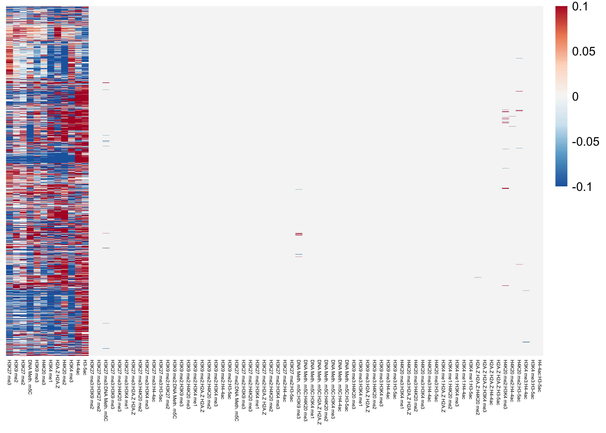
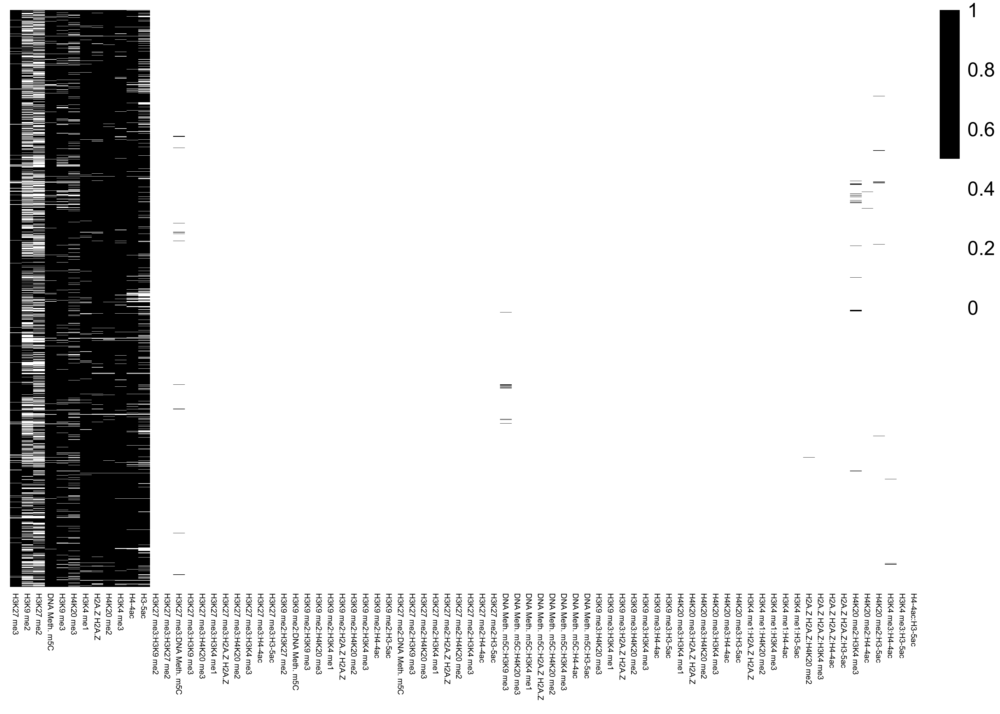
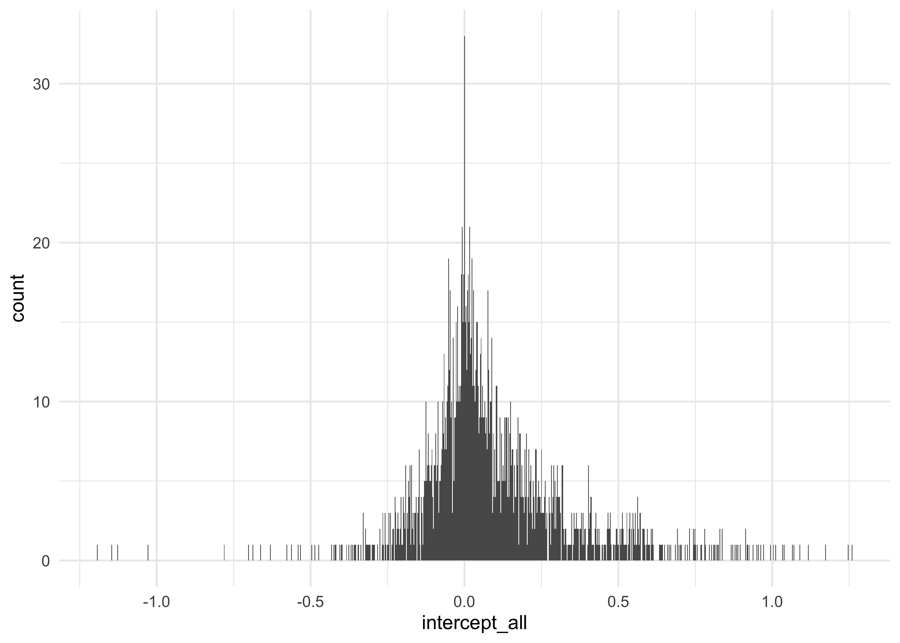
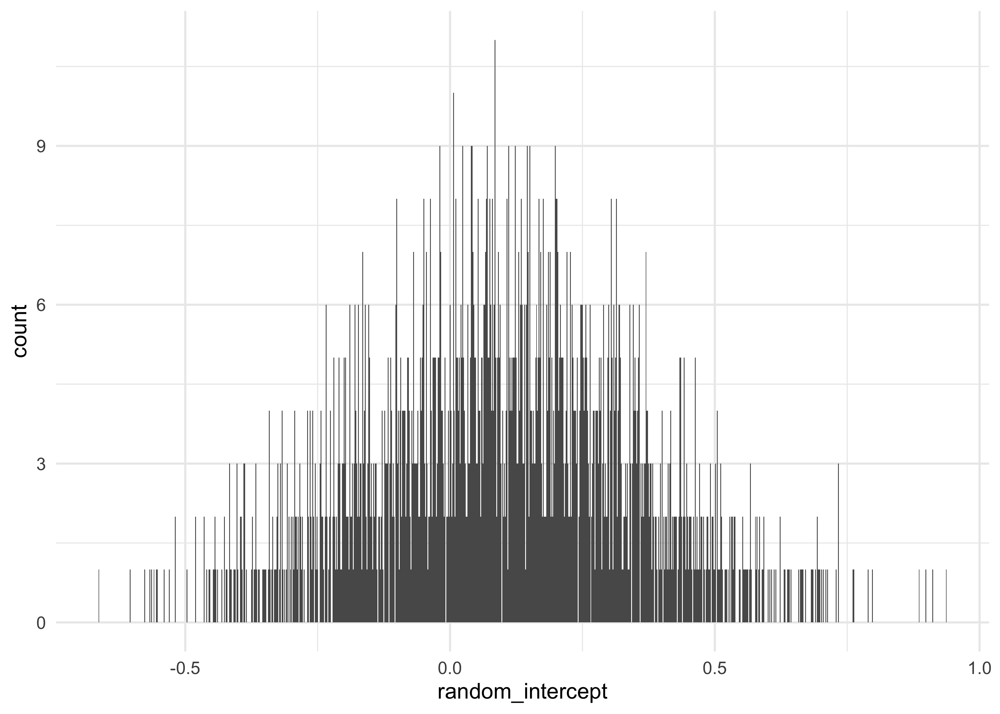
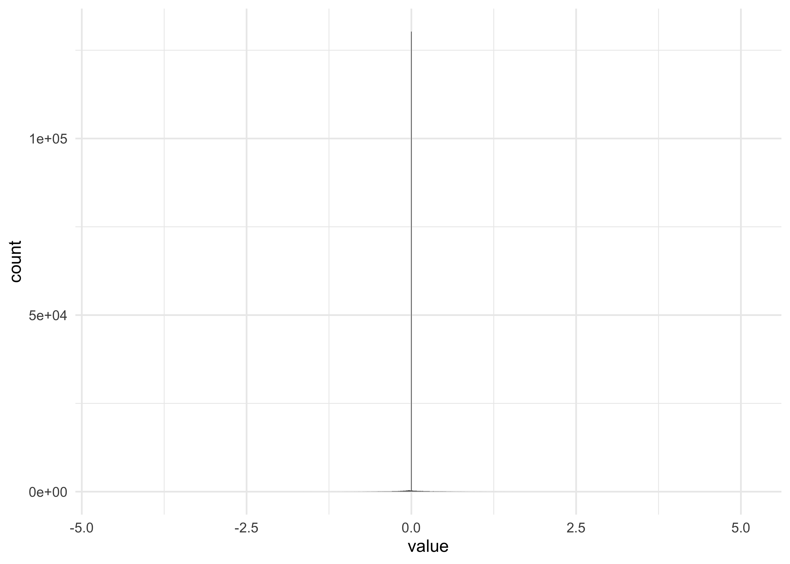
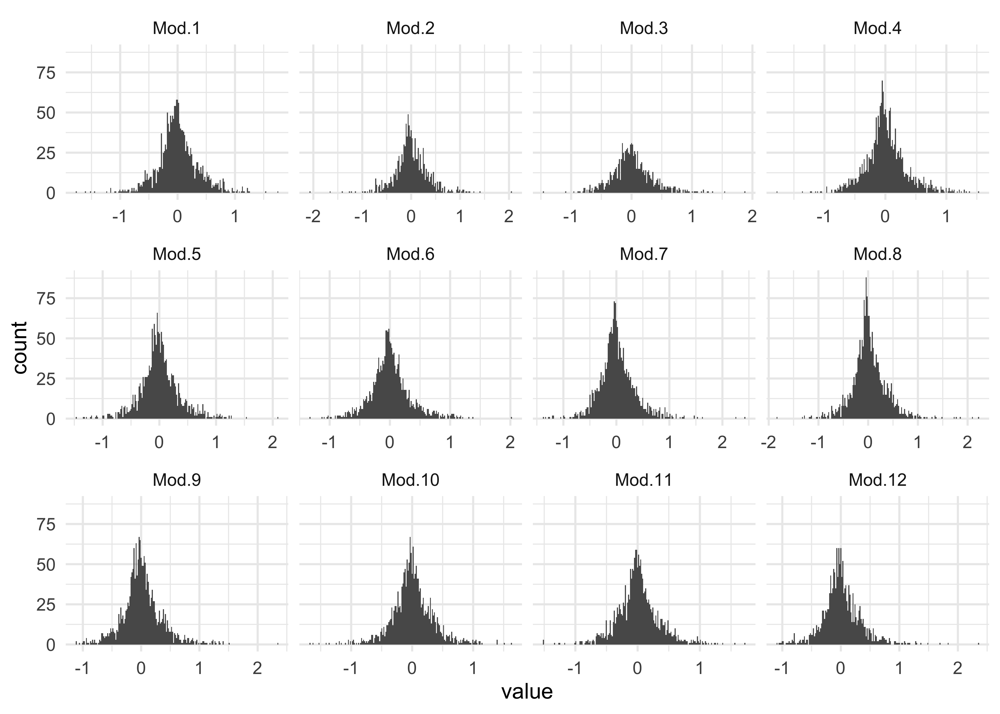
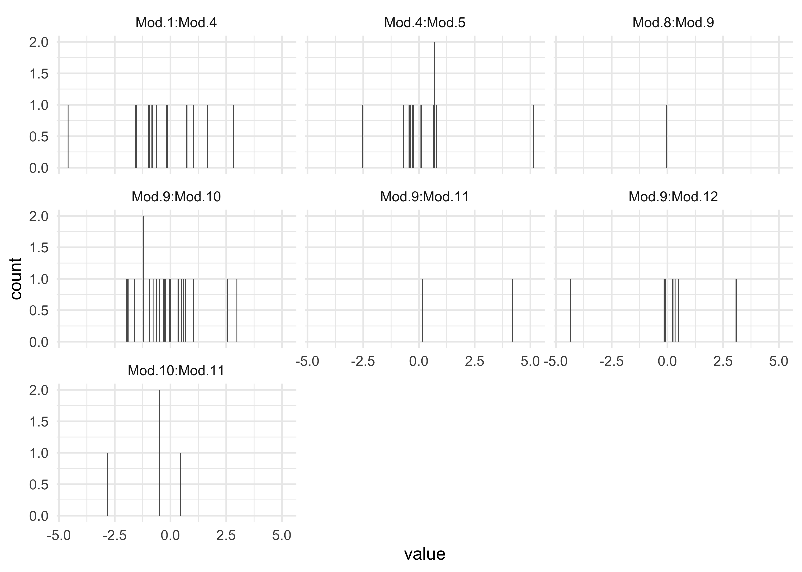
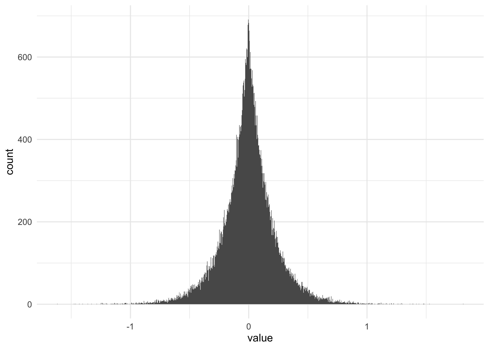
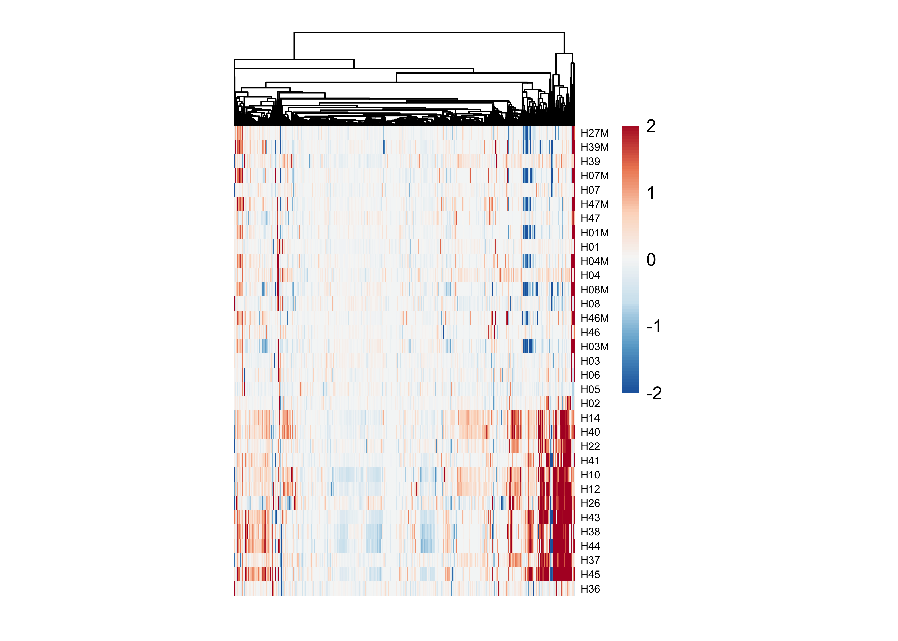

Synthetic data generation
================
Compiled at 2023-08-02 06:40:19 UTC

Data simulation procedure:

- We take the non-zero estimates of the real data (1915x78) and fit an
  asymetric laplace distribution to the data.

- We take the intercept estimates of the real data and fit a normal
  distribution to the data. This doesn’t give a perfect fit, but the
  scale/range of the data is approximately the same.

- We calculate the residuals in the real data and fit an asymetric
  laplace distribution to the residuals.

- We take the matrix L (binary library) as is (no real names).

- We do a de novo data generation of betas and thetas, intercept and
  noise term (of the same distribution as estimates).

- We then randomly distribute the synthetic betas and thetas comming
  from the joint asymtric laplace distribution on a coefficient matrix.

- To get a sparse matrix we replace entries in the coefficient matrix by
  zeros. To get synthetic proteins with the same amount of zero
  coefficients per protein and per beta or theta, we set the same
  entries in the coefficient matrix to zero as in the real data. A more
  general way would be to solve an integer linear program (ILP) for a
  binary matrix with fixed marginal distributions. With this, the number
  of selected features per protein is the same as for the real data.

- Now the data looks very similar to the real data. Only the interaction
  coefficients (theta) are rather small compared to the real data. We
  multiply the theta coefficients by the factor 4 to get interaction
  coefficients that are on a similar scale as the real interaction
  coefficients.

- Based on the generated data (intercept, coefficients and noise) we can
  calculate synthetic proteins.

### Visualize estimated coefficient matrix (MARCS data)

``` r
## read coef matrix
coef_matrix <- readRDS("data/results/coef_matrix.rds")
coef_matrix_plt <- coef_matrix
keep_prot <- which(colSums(abs(coef_matrix_plt))!=0)
coef_matrix_plt <- coef_matrix_plt[, keep_prot]
```

``` r
pheatmap(t(coef_matrix_plt), color = colorRampPalette(rev(brewer.pal(n = 7, name =
  "RdBu")))(100), breaks = seq(from = -.1, to = .1, length.out = 100),
  fontsize_row = 0.0001, fontsize_col = 4,
  cluster_rows = F, cluster_cols = F)
```

<!-- -->

### Non-zero entries coefficient matrix

``` r
coef_matrix_plt2 <- coef_matrix_plt
coef_matrix_plt2[(coef_matrix_plt2 != 0)] <- 1
```

``` r
pheatmap(t(coef_matrix_plt2), color = c("white", "black"),
  fontsize_row = 0.0001, fontsize_col = 4,
  cluster_rows = F, cluster_cols = F)
```

<!-- -->

### Read final model workflow

The final model (refitting step) is needed to check how intercept and
noise are distributed.

``` r
fit_lm <- readRDS("data/results/fit_lm.rds")
```

``` r
## read data
L <- readRDS("data/input/L-library.rds")
P <- readRDS("data/input/P-proteinsFandR.rds")
Pmean = log((2^P[, 1:1915] + 2^P[, (1915 + 1):ncol(P)])/2, base = 2)
```

## Distribution intercept

``` r
intercept_all <- c()
for(p in 1:length(fit_lm)){
  if(!is.null(fit_lm[[p]])){
  intercept_all[p] <- fit_lm[[p]]$coefficients[1]
  }
}
```

``` r
ggplot(as.data.frame(intercept_all), aes(intercept_all)) + 
    geom_histogram(bins = 1000) + theme_minimal()
```

<!-- -->

To simulate a random intercept we use a normal distribution. This
doesn’t fit the data perfectly, but the data lives on approx. the same
scale.

``` r
mintercept = mean(intercept_all, na.rm = T)
sdintercept = sd(intercept_all, na.rm = T)
set.seed(123)
random_intercept = rnorm(1915, mean = mintercept, sd = sdintercept)
```

``` r
ggplot(as.data.frame(random_intercept), aes(random_intercept)) + 
    geom_histogram(bins = 1000) + theme_minimal()
```

<!-- -->
\## Distribution estimated coefficients

Plot histogram of estimated linear coefficients:

``` r
coef_long <- as.data.frame(t(coef_matrix)) %>% gather()
coef_long$key = factor(coef_long$key, 
                            levels = unique(coef_long$key))
coef_long1 = coef_long[coef_long$key %in% rownames(coef_matrix)[1:12],]
coef_long1_nonzero <- coef_long1[coef_long1$value != 0,]
```

``` r
ggplot(coef_long1_nonzero, aes(value)) + 
    geom_histogram(bins = 200) + 
    facet_wrap(~key, scales = 'free_x') +
  theme_minimal()
```

<!-- -->

Plot histogram of estimated interaction coefficients:

``` r
coef_long2 = coef_long[coef_long$key %in% rownames(coef_matrix)[13:78],]
coef_long2_nonzero <- coef_long2[coef_long2$value != 0,]
```

``` r
ggplot(coef_long2_nonzero, aes(value)) + 
    geom_histogram(bins = 100) + 
    facet_wrap(~key)+
  theme_minimal()
```

<!-- -->

### Joint distribution of model coefficients

``` r
ggplot(coef_long, aes(value)) + 
    geom_histogram(bins = 1000) +
  geom_density() +
  theme_minimal()
```

<!-- -->

Joint distribution of model coefficients without zeros:

``` r
coef_long_nonzero = coef_long[coef_long$value != 0, ]

plt_dist_coef <- ggplot(coef_long_nonzero, aes(value)) + 
    geom_histogram(bins = 1000) + theme_minimal()
ggsave("/Users/mara.stadler/LRZ Sync+Share/PhD/MUDS_Projekt/temp/plt_dist_coef.pdf", plot = plt_dist_coef, height = 2, width = 4)
```

### Fit asymetric Laplace distribution to non-zero data

Estimate parameters from estimated coefficients

``` r
(paramAL = mleAL(coef_long_nonzero$value))
```

    ## $m
    ## [1] -0.03449841
    ## 
    ## $sigma
    ## [1] 0.118604
    ## 
    ## $tau
    ## [1] 0.4547313
    ## 
    ## $r
    ## [1] 7

``` r
set.seed(123)
## simulate data of the same size of real coefficients (including zeros)
sim_laplace <- rALD(length(coef_long$value), 
                    mu = paramAL$m,
                    sigma = paramAL$sigma,
                    p = paramAL$tau)
```

### Create simulated coefficient matrix

The barplot shows the amount of zeros in the real data.

``` r
coef_sim <- matrix(sim_laplace,
                   nrow = nrow(coef_matrix),
                   ncol = ncol(coef_matrix))

share_zeros = rowMeans(coef_matrix == 0)
barplot(share_zeros, las = 2, cex.names = 0.3, col = "white")
```

<!-- -->
add names

``` r
rownames_lin = paste0("Mod.", 1:12)
rownames_int <- c()
n <- 0
for(i in 1:(length(rownames_lin) - 1)){
  for(j in (i + 1): length(rownames_lin)){
    n <- n + 1
    rownames_int[n] <- paste0(rownames_lin[i], ":",
                              rownames_lin[j])
  }
}
rownames(coef_sim) <- c(rownames_lin, rownames_int)
```

For simplification, we use the same sparsity pattern in the synthetic
coefficient matrix as in the estimated coefficient matrix.

``` r
coef_sim_zi2 = coef_sim
ind_zeros_realdata = which(coef_matrix == 0)
coef_sim_zi2[ind_zeros_realdata] <- 0
```

When randomly drawing coefficients for the interaction coefficients the
range for the simulated interaction coefficients is smaller than in the
real data. For this, we multiply the interaction coefficients with the
factor 4.

``` r
coef_sim_zi2[13:78, ] <- coef_sim_zi2[13:78, ] * 4
```

simulated data long format

``` r
coef_sim_zi_long <- as.data.frame(t(coef_sim_zi2)) %>% gather()
```

Histogram zero-inflated asym. laplace simulated coefficients

``` r
ggplot(coef_sim_zi_long, aes(value)) + 
    geom_histogram(bins = 1000) + 
  theme_minimal()
```

<!-- -->
Now without zeros

``` r
coef_sim_zi_long_nonzero <- coef_sim_zi_long[coef_sim_zi_long$value != 0,]
ggplot(coef_sim_zi_long_nonzero, aes(value)) + 
    geom_histogram(bins = 1000) + 
  theme_minimal()
```

<!-- -->

Histogram for each feature estimate individually

``` r
coef_sim_zi_long1 = coef_sim_zi_long[coef_sim_zi_long$key %in% rownames(coef_sim)[1:12],]
coef_sim_zi_long1$key = factor(coef_sim_zi_long1$key, 
                            levels = unique(coef_sim_zi_long1$key))
coef_sim_zi_long1_nonzero <- coef_sim_zi_long1[coef_sim_zi_long1$value != 0,]
ggplot(coef_sim_zi_long1_nonzero, aes(value)) + 
    geom_histogram(bins = 200) + 
    facet_wrap(~key, scales = 'free_x') +
  theme_minimal()
```

<!-- -->

The synthetic data looks similar to the real data!

``` r
coef_sim_zi_long2 = coef_sim_zi_long[coef_sim_zi_long$key %in% rownames(coef_sim)[13:78],]
coef_sim_zi_long2$key = factor(coef_sim_zi_long2$key, 
                            levels = unique(coef_sim_zi_long2$key))

coef_sim_zi_long2_nonzero <- coef_sim_zi_long2[coef_sim_zi_long2$value != 0,]
ggplot(coef_sim_zi_long2_nonzero, aes(value)) + 
    geom_histogram(bins = 200) + 
    facet_wrap(~key) +
  theme_minimal()
```

<!-- -->

## Residuals observed

``` r
resid_all <- matrix(nrow = nrow(Pmean), ncol = ncol(Pmean))
for(p in 1:length(fit_lm)){
  if(!is.null(fit_lm[[p]])){
      resid_all[, p] <- resid(fit_lm[[p]])
  }
}

resid_df = data.frame(key = colnames(Pmean), value = as.vector(resid_all))

ggplot(resid_df, aes(value)) + 
    geom_histogram(bins = 1000) + 
  theme_minimal()
```

<!-- -->

## Fit Laplace distribution to residuals

``` r
(mm <- mean(as.vector(resid_all), na.rm = T))
```

    ## [1] -5.730504e-19

``` r
(bb <- 1/2 * sqrt(var(as.vector(resid_all), na.rm = T)))
```

    ## [1] 0.1634482

``` r
set.seed(123)
sim_laplace_resid <- rlaplace(length(as.vector(resid_all)), location = mm, scale = bb)

sim_laplace_resid_df = data.frame(key = colnames(Pmean), 
                                  value = as.vector(sim_laplace_resid))

ggplot(sim_laplace_resid_df, aes(value)) + 
    geom_histogram(bins = 1000) + 
  theme_minimal()
```

<!-- -->

### Compare protein data

## Read real data

``` r
## compute interaction matrix
Linteract <- cbind(L, hierNet::compute.interactions.c(L, diagonal = F))
```

``` r
Psim = random_intercept + Linteract %*% coef_sim_zi2 + 
  matrix(sim_laplace_resid, nrow = 33, ncol = 1915)
```

Plot real P

``` r
pheatmap(Pmean, cluster_rows = F, cluster_cols = T, 
                   border_color = "white",
                   color = colorRampPalette(rev(brewer.pal(n = 7, name =
  "RdBu")))(100), breaks = seq(-2, 2, length.out = 100),
                   cellwidth = 0.1, cellheight = 8,
                   fontsize_row = 6, fontsize_col = 0.0001
              )
```

<!-- -->

Plot simulated P

``` r
pheatmap(Psim, cluster_rows = F, cluster_cols = T, 
                   border_color = "white",
                   color = colorRampPalette(rev(brewer.pal(n = 7, name =
  "RdBu")))(100), breaks = seq(-2, 2, length.out = 100),
                   cellwidth = 0.1, cellheight = 8,
                   fontsize_row = 6, fontsize_col = 0.0001
              )
```

<!-- -->

## Files written

save simulated data

``` r
saveRDS(coef_sim_zi2, "data/results/coef_sim.rds")
saveRDS(sim_laplace_resid, "data/results/sim_laplace_resid.rds")
saveRDS(random_intercept, "data/results/random_intercept.rds")
```
