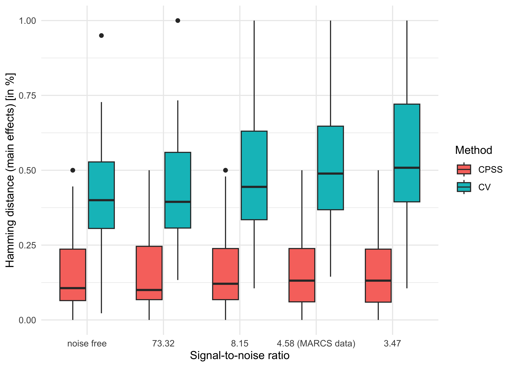
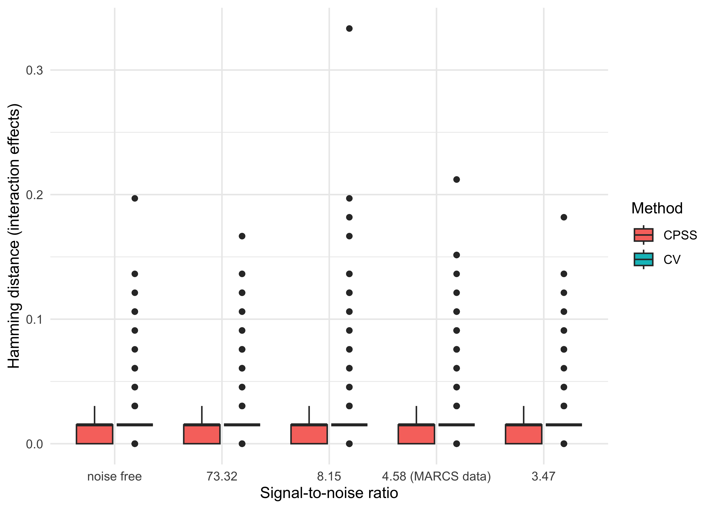

hiernet CPSS versus CV synthetic data
================
Compiled at 2023-08-02 06:39:25 UTC

The purpose of this document is to show the advantages of complementary
pairs stability selection (CPSS) over cross-validation in the
hierarchical interaction model.

We take the 58 synthetic proteins with interaction coefficients that we
have created in the previous step. First, we compare
5-fold-cross-validation (lambda selection with 1se rule) to CPSS in the
noise-free model (no noise and no intercept term).

### Read simulated data

``` r
coef_sim <- readRDS("data/results/coef_sim.rds")
sim_laplace_resid <- readRDS("data/results/sim_laplace_resid.rds")
random_intercept <- readRDS("data/results/random_intercept.rds")
```

## Read real data

``` r
## read data
L <- readRDS("data/input/L-library.rds")
Linteract <- cbind(L, hierNet::compute.interactions.c(L, diagonal = F))
## remove real names of modifications
colnames(Linteract) <- rownames(coef_sim)
P <- readRDS("data/input/P-proteinsFandR.rds")
Pmean = log((2^P[, 1:1915] + 2^P[, (1915 + 1):ncol(P)])/2, base = 2)
```

``` r
prot_interact = which(colSums(coef_sim[13:78,] != 0) > 0)
```

## hiernet with cv

``` r
hiernet_cv_binary <- function(p = p, x = L, y = Psim_noisefree,  seed = 234){
  
  zz_binary <- hierNet::compute.interactions.c(x, diagonal = FALSE)
  fit1 = hierNet.path(x = x,
                      y = y[, p], 
                      minlam = 0.001, maxlam = 20, nlam = 20,
                      diagonal = FALSE, strong = TRUE,
                      stand.int = FALSE, stand.main = TRUE,
                      zz = zz_binary)
  set.seed(seed)
  fit1cv = hierNet.cv(fit1, x, y[, p], nfolds = 5)
  list.cv <- fit1cv
  lamhat = fit1cv$lamhat.1se
  
  fit2 = hierNet(x = x, 
                 y = y[, p],
                 lam = lamhat, diagonal = FALSE, strong = TRUE,
                 stand.int = FALSE, stand.main = TRUE,
                 zz = zz_binary)
  
  
  theta <- (fit2$th + t(fit2$th))/2
  interact_p <- c()   
  q = 12
  m <- 0
  for(i in 1:(q - 1)){
    
    for(j in (i + 1):q){
      m <- m + 1
      interact_p[m] <-  theta[i, j] # interaction coef. modif. i and j
    }
    
  }
  coef_p <- c(fit2$bp + (-fit2$bn), interact_p)
  
  return(coef_p)
}
```

## Hiernet CPSS

``` r
hiernet.lasso.binary <- function(x, y, q, l = 12){
  
  if (!requireNamespace("hierNet", quietly = TRUE))
    stop("Package ", sQuote("hierNet"), " needed but not available")
  
  
  x.lin <- x[, 1:l]
  p_init <- ncol(x.lin)
  ## there might be zero columns (modifications) after removing observations
  ## (subsampling) which compute.interactions can't handle:
  ## Remove zero columns
  col_sub = apply(x.lin, 2, function(col) all(col == 0 ))
  x.lin = x.lin[, !col_sub]
  
  
  nlam = 20
  
  
  
  ## with passing zz we avoid that zz gets computed based on the scaled x
  ## which is not wanted for binary features
  zz_binary <- compute.interactions.c(x.lin, diagonal = FALSE)
  fit <- hierNet::hierNet.path(x.lin, y, minlam = .001, maxlam = 20, 
                               nlam = nlam, diagonal = FALSE, strong = TRUE,
                               stand.int = FALSE, stand.main = TRUE,
                              zz = zz_binary
  )
  
  p <- ncol(x.lin)
  coefmatrix_lam <- matrix(nrow = p * (p + 1)/2, ncol = nlam)
  ## calculate linear coefficients
  linear_coef <- fit$bp - fit$bn 
  
  for(lam in 1:length(fit$lamlist)){
    ## symmetrize theta
    theta <- (fit$th[, , lam] + t(fit$th[, , lam]))/2 
    interact_coef <- theta[lower.tri(theta)]
    ## combine linear effects and interactions
    coefmatrix_lam[, lam] <- c(linear_coef[, lam], interact_coef) 
    
  }
  
  ## interaction feature names after potentially removing linear features
  A <- colnames(x.lin)
  n <- 0
  names_int <- c()
  for(i in 1:(ncol(x.lin) - 1)){
    for(j in (i + 1): ncol(x.lin)){
      n <- n + 1
      names_int[n] <- paste0(A[i], ":", A[j])
    }
  }
  
  rownames(coefmatrix_lam) <- c(colnames(x.lin), names_int)
  
  ## Empty matrix with all features (also the ones that where removed before)
  sequence <- matrix(nrow = p_init * (p_init + 1)/2, ncol = nlam)
  rownames(sequence) <- colnames(x)
  sequence[rownames(coefmatrix_lam), ] <- (coefmatrix_lam != 0)
  sequence[is.na(sequence)] <- 0
  
  ## select the lambda where number of selected features is <= q
  seq_q <- which(colSums(sequence) <= q)
  ret <- sequence[, seq_q[length(seq_q)]]
  
  ## return both
  return(list(selected = ret, path = sequence))
}

## run stability selection
stabsel_p <- function(p, seed = 123, x = Linteract, y = Psim){
  set.seed(seed)
  y_p <- y[, p]
  ret <- stabs::stabsel(x = x, y = y_p, 
                 fitfun = hiernet.lasso.binary, cutoff = 0.6,
                 q = 12, sampling.type = "SS" )
  return(ret)
}         
```

## Simulations with different signal-to-noise ratios

We create synthetic datasets with five different noise levels. Noise
level 1 corresponds to the noise level we observe in the MARCS data.

``` r
Psim_noisefree = random_intercept + 
  Linteract %*% coef_sim + 0 * matrix(sim_laplace_resid, nrow = 33, ncol = 1915)

Psim_025noise = random_intercept + 
  Linteract %*% coef_sim + 0.25 * matrix(sim_laplace_resid, nrow = 33, ncol = 1915)


Psim_075noise = random_intercept + 
  Linteract %*% coef_sim + 0.75 * matrix(sim_laplace_resid, nrow = 33, ncol = 1915)


Psim_100noise = random_intercept + 
  Linteract %*% coef_sim + 1.00 * matrix(sim_laplace_resid, nrow = 33, ncol = 1915)


Psim_125noise = random_intercept + 
  Linteract %*% coef_sim + 1.25 * matrix(sim_laplace_resid, nrow = 33, ncol = 1915)
```

## SNR - Signal-to-noise ratio

``` r
n <- 1
SNR <- c()
SNR[1] <- "noise free"
for(i in c(.25, .75, 1, 1.15)){
  n <- n + 1
  SNR[n] <- round(var(as.vector(Linteract %*% coef_sim))/var(i*sim_laplace_resid), 2)
}
SNR
```

    ## [1] "noise free" "73.32"      "8.15"       "4.58"       "3.47"

We run the model for 58 proteins for each noise level 20 times (20
replicates).

``` r
## run cv on cluster
library(parallel)

P_all <- list(Psim_noisefree, Psim_025noise, Psim_075noise,
               Psim_100noise, Psim_125noise)
names_p <- c("0", "25", "75", "100", "125")
for(PP in seq(length(P_all))){
  hiernet_cv_synth <- list()
  for(repl in 1:20){
    
    hiernet_cv_synth[[repl]] <- mclapply(as.list(prot_interact), 
                                         hiernet_cv_binary, seed = repl, y = P_all[[PP]],
                                         mc.cores = 20, mc.preschedule = FALSE)
  }
  
  saveRDS(hiernet_cv_synth, paste0("hiernet_cv_synth_noise_", names_p[PP],".rds"))
  
}


for(PP in seq(length(P_all))){
  hiernet_cpss_synth <- list()
  for(repl in 1:20){
    
    hiernet_cpss_synth[[repl]] <- mclapply(as.list(prot_interact), 
                                           stabsel_p, seed = repl, y = Psim_125noise,
                                           mc.cores = 20, mc.preschedule = FALSE)
  }
  
  saveRDS(hiernet_cpss_synth, paste0("hiernet_cpss_synth_noise_", names_p[PP],".rds"))
  
}
```

## F1 score

``` r
## F1 score CV
hiernet_cv_synth_all_noiselevels <- list(hier_cv_0, hier_cv_25, hier_cv_75,
                                           hier_cv_100, hier_cv_125)


compute_f1_score_matrix_cv <- function(model_output = hiernet_cv_synth_noise0){
  F1_score_matrix <- matrix(nrow = 20, ncol = length(prot_interact)) ## replicates x proteins
  
  for(repl in 1:20){
    for(prot in seq(length(prot_interact))){
      F1_score_matrix[repl, prot] <- Metrics::f1(which(coef_sim[, prot_interact[prot]] != 0),
                                       which(model_output[[repl]][[prot]] != 0))
    }
  }
  return(F1_score_matrix)
}


F1_score_matrix_cv_all_noiselevels <- lapply(hiernet_cv_synth_all_noiselevels,
                                              compute_f1_score_matrix_cv)

## F1 score CPSS 

hiernet_cpss_synth_all_noiselevels <- list(hier_cpss_0, hier_cpss_25, hier_cpss_75, hier_cpss_100, hier_cpss_125)


compute_f1_score_matrix_cpss <- function(model_output = hiernet_cpss_synth_noise0) {
  
  F1_score_matrix <- matrix(nrow = 20, ncol = length(prot_interact)) ## replicates x proteins
  
  for(repl in 1:20){
    for(prot in seq(length(prot_interact))){
      F1_score_matrix[repl, prot] <- Metrics::f1(which(coef_sim[, prot_interact[prot]] != 0),
                                                 which(model_output[[repl]][[prot]]$max >= .5))
    }
  }
  return(F1_score_matrix)
}


F1_score_matrix_cpss_all_noiselevels <- lapply(hiernet_cpss_synth_all_noiselevels,
                                              compute_f1_score_matrix_cpss)
```

``` r
## change data to long format for plotting
## CV
## convert matrices (replicates x proteins) to vectors of length 20*58=1160
F1_score_matrix_cv_all_noiselevels_vec <- lapply(F1_score_matrix_cv_all_noiselevels, as.vector)
## covert list of vectors to matrix
F1_score_matrix_cv_all_noiselevels_mat <- do.call(rbind, F1_score_matrix_cv_all_noiselevels_vec)
rownames(F1_score_matrix_cv_all_noiselevels_mat) <- paste0(SNR, c("", "", "", " (MARCS data)", ""))
## convert matrix to long format
F1_score_matrix_cv_all_noiselevels_long <- reshape2::melt(t(F1_score_matrix_cv_all_noiselevels_mat))
F1_score_matrix_cv_all_noiselevels_long$method <- "CV"
colnames(F1_score_matrix_cv_all_noiselevels_long) <- c("ind", "SNR", "F1 score", "Method")

## CPSS
## convert matrices (replicates x proteins) to vectors of length 20*58=1160
F1_score_matrix_cpss_all_noiselevels_vec <- lapply(F1_score_matrix_cpss_all_noiselevels, as.vector)
## covert list of vectors to matrix
F1_score_matrix_cpss_all_noiselevels_mat <- do.call(rbind, F1_score_matrix_cpss_all_noiselevels_vec)
rownames(F1_score_matrix_cpss_all_noiselevels_mat) <- paste0(SNR, c("", "", "", " (MARCS data)", ""))
## convert matrix to long format
F1_score_matrix_cpss_all_noiselevels_long <- reshape2::melt(t(F1_score_matrix_cpss_all_noiselevels_mat))
F1_score_matrix_cpss_all_noiselevels_long$method <- "CPSS"
colnames(F1_score_matrix_cpss_all_noiselevels_long) <- c("ind", "SNR", "F1 score", "Method")


## merge CV and CPSS F1 tables into one dataset

F1_score_long_cv_cpss <- rbind(F1_score_matrix_cv_all_noiselevels_long,F1_score_matrix_cpss_all_noiselevels_long)
F1_score_long_cv_cpss[1:3, ]
```

    ##   ind        SNR  F1 score Method
    ## 1   1 noise free 0.7058824     CV
    ## 2   2 noise free 0.7058824     CV
    ## 3   3 noise free 0.7058824     CV

``` r
## plot f1 score per SNR and method
plt_f1 <- ggplot2::ggplot(F1_score_long_cv_cpss, aes(x = `SNR`, y = `F1 score`, fill = Method)) + 
 stat_summary(
    fun.y = median,
    geom = 'line',
    aes(group = Method, colour = Method),
    position = position_dodge(width = 0.9)
  ) + 
  xlab("Signal-to-noise ratio") + 
  geom_boxplot() + 
  theme_minimal()
plt_f1
```

<!-- -->

``` r
## Every boxplot is based on 58 * 20 = 1160 F1-scores (proteins x replicates)
nrow(F1_score_long_cv_cpss[which(F1_score_long_cv_cpss$`SNR`=="noise free" &
                                 F1_score_long_cv_cpss$Method ==  "CV" ),]) == 58 * 20
```

    ## [1] TRUE

## Hamming distance only main effects

``` r
## CV
hiernet_cv_synth_all_noiselevels <- list(hier_cv_0, hier_cv_25, hier_cv_75,
                                         hier_cv_100, hier_cv_125)


compute_hamming_matrix_cv <- function(model_output = hier_cv_0){
  hamming_matrix <- matrix(nrow = 20, ncol = length(prot_interact)) ## replicates x proteins
  
  for(repl in 1:20){
    for(prot in seq(length(prot_interact))){
      hamming_matrix[repl, prot] <- sum((coef_sim[1:12, prot_interact[prot]] != 0) !=
                                          (model_output[[repl]][[prot]][1:12] != 0))/12
    }
    
  }
  return(na.omit(hamming_matrix))
}


hamming_matrix_cv_all_noiselevels <- lapply(hiernet_cv_synth_all_noiselevels,
                                            compute_hamming_matrix_cv)


## Mean Hamming distance for every protein and replicate (mean over 20 replicates)
mean_hamming_matrix_cv_all_noiselevels <- lapply(hamming_matrix_cv_all_noiselevels, colMeans)

str(mean_hamming_matrix_cv_all_noiselevels)
```

    ## List of 5
    ##  $ : num [1:58] 0.311 0.511 0.622 0.478 0.594 ...
    ##  $ : num [1:58] 0.406 0.528 0.672 0.517 0.617 ...
    ##  $ : num [1:58] 0.633 0.489 0.8 0.522 0.806 ...
    ##  $ : num [1:58] 0.744 0.489 0.8 0.511 0.861 ...
    ##  $ : num [1:58] 0.806 0.539 0.833 0.506 0.906 ...

``` r
## F1 score CPSS 

hiernet_cpss_synth_all_noiselevels <- list(hier_cpss_0, hier_cpss_25, hier_cpss_75,
                                           hier_cpss_100, hier_cpss_125)


compute_hamming_matrix_cpss <- function(model_output = hiernet_cpss_synth_noise0) {
  
  hamming_matrix <- matrix(nrow = 20, ncol = length(prot_interact)) ## replicates x proteins
  
  for(repl in 1:20){
    for(prot in seq(length(prot_interact))){
      hamming_matrix[repl, prot] <- sum((coef_sim[1:12, prot_interact[prot]] != 0) !=
                                          (model_output[[repl]][[prot]]$max[1:12] >= .5))/12
    }
  }
  return(na.omit(hamming_matrix))
}


hamming_matrix_cpss_all_noiselevels <- lapply(hiernet_cpss_synth_all_noiselevels,
                                              compute_hamming_matrix_cpss)

str(hamming_matrix_cpss_all_noiselevels)
```

    ## List of 5
    ##  $ : num [1:20, 1:58] 0.0833 0.0833 0.0833 0.0833 0.0833 ...
    ##  $ : num [1:20, 1:58] 0.0833 0.0833 0.0833 0.0833 0.0833 ...
    ##  $ : num [1:20, 1:58] 0.1667 0.0833 0.1667 0.0833 0.1667 ...
    ##  $ : num [1:20, 1:58] 0.1667 0.0833 0.1667 0.1667 0.1667 ...
    ##  $ : num [1:20, 1:58] 0.167 0.167 0.167 0.167 0.167 ...

``` r
## Mean Hamming distance for every protein and replicate (mean over 20 replicates)
mean_hamming_matrix_cpss_all_noiselevels <- lapply(hamming_matrix_cpss_all_noiselevels, colMeans)

str(mean_hamming_matrix_cpss_all_noiselevels)
```

    ## List of 5
    ##  $ : num [1:58] 0.08333 0.00833 0.23333 0.15833 0.07083 ...
    ##  $ : num [1:58] 0.09583 0.00833 0.20417 0.15833 0.1 ...
    ##  $ : num [1:58] 0.121 0 0.175 0.146 0.121 ...
    ##  $ : num [1:58] 0.137 0 0.167 0.158 0.137 ...
    ##  $ : num [1:58] 0.154 0 0.167 0.15 0.129 ...

``` r
## change data to long format
## CV
## convert matrices (replicates x proteins) to vectors of length 20*58=1160
hamming_matrix_cv_all_noiselevels_vec <- mean_hamming_matrix_cv_all_noiselevels
## covert list of vectors to matrix
hamming_matrix_cv_all_noiselevels_mat <- do.call(rbind, hamming_matrix_cv_all_noiselevels_vec)
rownames(hamming_matrix_cv_all_noiselevels_mat) <- paste0(SNR, c("", "", "", " (MARCS data)", ""))
## convert matrix to long format
hamming_matrix_cv_all_noiselevels_long <- reshape2::melt(t(hamming_matrix_cv_all_noiselevels_mat))
hamming_matrix_cv_all_noiselevels_long$method <- "CV"
colnames(hamming_matrix_cv_all_noiselevels_long) <- c("ind", "SNR", "Hamming distance", "Method")

## CPSS
## convert matrices (replicates x proteins) to vectors of length 20*58=1160
hamming_matrix_cpss_all_noiselevels_vec <- mean_hamming_matrix_cpss_all_noiselevels
## covert list of vectors to matrix
hamming_matrix_cpss_all_noiselevels_mat <- do.call(rbind, hamming_matrix_cpss_all_noiselevels_vec)
rownames(hamming_matrix_cpss_all_noiselevels_mat) <- paste0(SNR, c("", "", "", " (MARCS data)", ""))
## convert matrix to long format
hamming_matrix_cpss_all_noiselevels_long <- reshape2::melt(t(hamming_matrix_cpss_all_noiselevels_mat))
hamming_matrix_cpss_all_noiselevels_long$method <- "CPSS"
colnames(hamming_matrix_cpss_all_noiselevels_long) <- c("ind", "SNR", "Hamming distance", "Method")


## merge CV and CPSS F1 tables into one dataset

hamming_long_cv_cpss <- rbind(hamming_matrix_cv_all_noiselevels_long,hamming_matrix_cpss_all_noiselevels_long)
hamming_long_cv_cpss[1:3, ]
```

    ##   ind        SNR Hamming distance Method
    ## 1   1 noise free        0.3111111     CV
    ## 2   2 noise free        0.5111111     CV
    ## 3   3 noise free        0.6222222     CV

``` r
plt_hamming_main <- ggplot2::ggplot(hamming_long_cv_cpss, aes(x = `SNR`, y = `Hamming distance`, fill = Method)) + 
    geom_boxplot() +
  xlab("Signal-to-noise ratio") +
  ylab("Hamming distance (main effects) [in %]") +
  theme_minimal()

plt_hamming_main
```

<!-- -->

## Hamming distance only interactions

    ##   ind        SNR Hamming distance Method
    ## 1   1 noise free       0.01515152     CV
    ## 2   2 noise free       0.01515152     CV
    ## 3   3 noise free       0.01515152     CV

``` r
plt_hamming_int <- ggplot2::ggplot(hamming_long_cv_cpss, aes(x = `SNR`, 
                                           y = `Hamming distance`, 
                                           fill = Method)) + 
    geom_boxplot() +
  xlab("Signal-to-noise ratio") +
  ylab("Hamming distance (interaction effects)") +
  theme_minimal()


plt_hamming_int
```

<!-- -->
